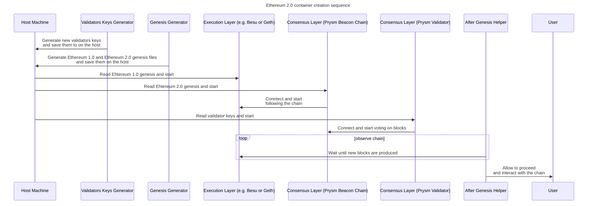

# Blockchain nodes

It is highly advised that if you did decide to play around with these Docker containers that you use an existing Ethereum enviroment builder
instead of trying to put all the pieces together. That's especially important for Proof-Of-Stake networks, where the setup is a multi-stage
operation that needs to be executed in specific order and where multiple containers need access to the same (or shared) state.

By default, each of supported clients has a default image version that's defined [here](https://github.com/smartcontractkit/chainlink-testing-framework/blob/main/lib/docker/ethereum/images.go).
All of them apart from Reth, come in two flavours: one that is a Proof-Of-Stake (Ethereum 2.0) network and another that's a Proof-Of-Work/Authority (Ethereum 1.0). Reth has only the former
since the latter was never implemented by its creators.

All of these epehemeral networks are using a grossly simplified configuration that is composed of a single blockchain node. Technically that's also true, in case of PoS networks,
even though they are running three containers:
* execution layer container
* consensus layer container
* validator

> [!NOTE]
> We use our own fork of [Ethereum Genesis Generator](https://github.com/ethpandaops/ethereum-genesis-generator) to
> create genesis files both for PoW/PoA and PoS Ethereum networks.

## Execution Layer
Following execution layers are available
* Besu
* Erigon
* Geth
* Nethermind
* Reth

## Consensus Layer
Only one consensus client is available: Prysm.

# Quick start
The simplest of starting a new Ethereum network is by specifying only the execution layer:
```go
builder := NewEthereumNetworkBuilder()
cfg, err := builder.
    WithExecutionLayer(types.ExecutionLayer_Nethermind).
    Build()
if err != nil {
    panic(err)
}

net, rpcs, err := cfg.Start()
if err != nil {
    panic(err)
}
```

If no Ethereum version is specified, Ethereum 1.0 (pre-Merge) will be used.

# Ethereum 2 network
To start Ethereum 2.0 network you need to pass one more parameter to the builder:
```go
builder := NewEthereumNetworkBuilder()
cfg, err := builder.
    // notice the new parameter
    WithEthereumVersion(config_types.EthereumVersion_Eth2).
    WithExecutionLayer(config_types.ExecutionLayer_Geth).
    Build()
if err != nil {
    panic(err)
}

net, rpcs, err := cfg.Start()
if err != nil {
    panic(err)
}
```

> [!NOTE]
> It takes significantly longer to boot up an Ethereum 2.0 network due to number of
> containers involved. 1 minute long wait times are not unheard of, so if startup
> speed is crucial think if Ethereum 1.0 is good enough for your use case.

# Custom docker images
If you don't want to use default image versions you can pass custom ones in the following manner:
```go
builder := NewEthereumNetworkBuilder()
cfg, err := builder.
    WithCustomDockerImages(map[config.ContainerType]string{
        config.ContainerType_ExecutionLayer: "ethereum/client-go:v1.15.0",
    }).
    Build()
if err != nil {
    panic(err)
}

net, rpcs, err := cfg.Start()
if err != nil {
    panic(err)
}
```
Where available container types are:
```go
const (
	ContainerType_ExecutionLayer     ContainerType = "execution_layer"
	ContainerType_ConsensusLayer     ContainerType = "consensus_layer"
	ContainerType_ConsensusValidator ContainerType = "consensus_validator"
	ContainerType_GenesisGenerator   ContainerType = "genesis_generator"
	ContainerType_ValKeysGenerator   ContainerType = "val_keys_generator"
)
```
When passing custom docker image for execution layer you don't need to use neither `WithEthereumVersion()` nor `WithExecutionLayer()` functions
as we will get these from the Docker image.

> [!NOTE]
> There are two useful "synthetic" Docker tags you can use with custom images:
> - `latest_available` - which represents the latest release (including pre-releases)
> - `latest_stable` - which represents latest **stable** release

# Existing Docker network(s)
By default, the chain will be started on a new Docker network with random name. If you want it to connect to existing one instead, use the following option:
```go
builder := NewEthereumNetworkBuilder()
cfg, err := builder.
    WithExecutionLayer(types.ExecutionLayer_Nethermind).
    WithDockerNetworks([]string{"my-existing-network"}).
    Build()
if err != nil {
    panic(err)
}
```

# Chain customisation
Below you will find a description of easily customisable parameters of the chain or its startup.

## Slots per epoch and seconds per slot (Ethereum 2.0 only)
These parameters control how fast epochs progress.

`Seconds per slot` represents the number of seconds that validator have to vote on blocks.
The lower the value the faster the epoch finalisation. If it's too low, validators will not be
able to vote and no new blocks will be produced. Minimum allowed value is `3`.

`Slots per epoch` represent the number of voting runds per epoch. The lower the number, the faster
the finalization. Minimum allowed value is `2.`

## ChainID
Can be anything as long as it's an integer.

## Addresses to fund
Addresses that will be funded with `9000000000000000000000000000 wei` in the genesis.

## Hard Forks (Ethereum 2.0 only)
Map of hard fork name to epoch, in which the fork should happen. Has to be `> 0`. It's useful for testing
how software will behave during the fork. Currently, the only fork that's supported is `Deneb`, but it can
only be used with Docker images that belong to "pre-Deneb times" and running on `Shanghai` version of Ethereum 2.0
(so pretty old versions). For the latest images there are no supported future forks as of time of this documentation
creation there were no dates set for any of the incoming forks (which means none of them is supported by neither
execution nor consensus layer clients).

## Validator count (Ethereum 2.0 only)
Number of validators to run. `4` is a minimum allowed.

## Genesis Delay (Ethereum 2.0 only)
Extra delay added to genesis block timestamp to be sure that both layers are up and running before it happens. Increasing it could be
useful in case of running on very slow system.

## Default values
Default chain config comes with the following values:
```toml
seconds_per_slot=12
slots_per_epoch=6
genesis_delay=15
validator_count=8
chain_id=1337
addresses_to_fund=["0xf39Fd6e51aad88F6F4ce6aB8827279cffFb92266"]
```

# Other useful options
## Blockchain node log level
By default, all blockchain nodes use `info` log level, but you can change that with the following option:
```go
builder := NewEthereumNetworkBuilder()
cfg, err := builder.
    WithCustomDockerImages(map[config.ContainerType]string{
        config.ContainerType_ExecutionLayer: "ethereum/client-go:v1.15.0",
    }).
    WithNodeLogLevel("debug").
    Build()
if err != nil {
    panic(err)
}
```
This configuration is applied only to execution layer nodes. Following values are supported:
* `trace`
* `debug`
* `info`
* `warn`
* `error`

## Waiting for first epoch finalization (Ethereum 2.0 only)
In case you want the network to wait until first epoch has been finalised you can use the following option:
```go
builder := NewEthereumNetworkBuilder()
cfg, err := builder.
    WithCustomDockerImages(map[config.ContainerType]string{
        config.ContainerType_ExecutionLayer: "ethereum/client-go:v1.15.0",
    }).
    WithWaitingForFinalization().
    Build()
if err != nil {
    panic(err)
}
```

# Accessing containers from inside and outside of the Docker network
Function that starts the environment returns an error or two values:
* instance of `blockchain.Network` that can be used to start our test clients
* instance of `test_env.RpcProvider` that has a list of useful endpoints

These endpoints come in two flavours:
* public (accessible from other Docker networks and the host machine)
* private (accessible only from inside the same Docker network)

And are the HTTP and WS endpoints of the execution layer clients, ones which the Chainlink Node
needs to communicate with. Beacon Chain (consensus layer) endpoints are not exposed.

If you're wondering which one to use, the usual case would be:
* public for the Ethereum Client that will interact with the chain, deploy contracts, etc.
* private for the Chainlink Node if it uses the same Docker network as the chain, public otherwise

# Ethereum 2.0 container creation sequence
Since the sequence of container creation and interaction for Ethereum 2.0 is much more complicated
than for Ethereum 1.0 (where we only need to start a single container) below you will find a sequence
diagram that explains it in more detail:

