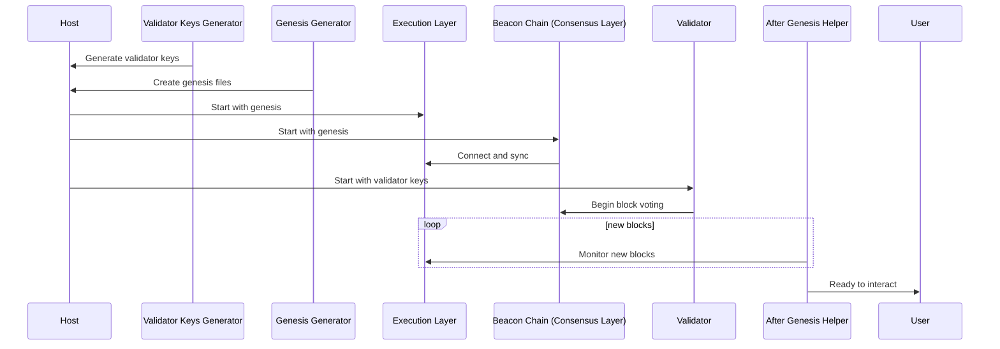

# Blockchain Nodes

If you plan to experiment with these Docker containers, **use an existing Ethereum environment builder** rather than assembling components manually. This is particularly important for Proof-of-Stake (PoS) networks, where the setup involves multi-stage operations and shared state across multiple containers.

Each supported client has a default image version defined [here](https://github.com/smartcontractkit/chainlink-testing-framework/blob/main/lib/docker/ethereum/images.go). Clients (except Reth) are available in two flavors:
- **Proof-of-Stake (PoS)**: Ethereum 2.0.
- **Proof-of-Work/Authority (PoW/PoA)**: Ethereum 1.0.

Reth supports only PoS networks.

These ephemeral networks use a simplified configuration with a single blockchain node. For PoS, three containers simulate this:
- Execution layer
- Consensus layer
- Validator

> [!NOTE]
> We use a fork of [Ethereum Genesis Generator](https://github.com/ethpandaops/ethereum-genesis-generator) to create genesis files for PoS networks.

---

## Execution Layer Clients
The following execution layer clients are available:
- Besu
- Erigon
- Geth
- Nethermind
- Reth

## Consensus Layer Client
- **Prysm** (the only available consensus client).

---

# Quick Start

The simplest way to start an Ethereum network is by specifying the execution layer only:

```go
builder := NewEthereumNetworkBuilder()
cfg, err := builder.
    WithExecutionLayer(types.ExecutionLayer_Nethermind).
    Build()
if err != nil {
    panic(err)
}

net, rpcs, err := cfg.Start()
if err != nil {
    panic(err)
}
```
If no version is specified, **Ethereum 1.0 (pre-Merge)** will be used.

### Starting Ethereum 2.0 Networks
To start an Ethereum 2.0 network, add the Ethereum version parameter:

```go
builder := NewEthereumNetworkBuilder()
cfg, err := builder.
    WithEthereumVersion(config_types.EthereumVersion_Eth2).
    WithExecutionLayer(config_types.ExecutionLayer_Geth).
    Build()
if err != nil {
    panic(err)
}

net, rpcs, err := cfg.Start()
if err != nil {
    panic(err)
}
```
> [!NOTE]
> Booting Ethereum 2.0 networks takes longer due to the additional containers. Wait times of up to 1 minute are common.

---

## Custom Docker Images
To use custom Docker images instead of the defaults:

```go
builder := NewEthereumNetworkBuilder()
cfg, err := builder.
    WithCustomDockerImages(map[config.ContainerType]string{
        config.ContainerType_ExecutionLayer: "ethereum/client-go:v1.15.0",
    }).
    Build()
if err != nil {
    panic(err)
}

net, rpcs, err := cfg.Start()
if err != nil {
    panic(err)
}
```
### Available Container Types
```go
const (
    ContainerType_ExecutionLayer     ContainerType = "execution_layer"
    ContainerType_ConsensusLayer     ContainerType = "consensus_layer"
    ContainerType_ConsensusValidator ContainerType = "consensus_validator"
    ContainerType_GenesisGenerator   ContainerType = "genesis_generator"
    ContainerType_ValKeysGenerator   ContainerType = "val_keys_generator"
)
```
> [!NOTE]
> Use the `latest_available` tag for the most recent release, including pre-releases, or the `latest_stable` tag for the latest officially stable release. The `latest_available` may include beta or development versions, whereas `latest_stable` ensures compatibility with production environments.

---

# Advanced Options

## Connect to Existing Docker Networks
By default, a new random Docker network is created. To use an existing one:

```go
builder := NewEthereumNetworkBuilder()
cfg, err := builder.
    WithExecutionLayer(types.ExecutionLayer_Nethermind).
    WithDockerNetworks([]string{"my-existing-network"}).
    Build()
```

## Chain Customization

### Ethereum 2.0 Parameters
- **Seconds per slot**: This defines how many seconds validators have to propose and vote on blocks. Lower values accelerate block production and epoch finalization but can cause issues if validators fail to keep up. The minimum allowed value is `3`.
- **Slots per epoch**: Determines the number of slots (voting rounds) per epoch. Lower values mean epochs finalize faster, but fewer voting rounds can impact network stability. The minimum value is `2`.
- **Genesis delay**: The extra delay (in seconds) before the genesis block starts. This ensures all containers (execution, consensus, and validator) are up and running before block production begins.
- **Validator count**: Specifies the number of validators in the network. A higher count increases the robustness of block validation but requires more resources. The minimum allowed value is `4`.

### General Parameters
- **ChainID**: Integer value for the chain.
- **Addresses to fund**: Pre-fund accounts in the genesis block.

### Default Configuration
```toml
seconds_per_slot=12
slots_per_epoch=6
genesis_delay=15
validator_count=8
chain_id=1337
addresses_to_fund=["0xf39Fd6e51aad88F6F4ce6aB8827279cffFb92266"]
```

---

## Log Level
Customize node log levels (default: `info`):
```go
WithNodeLogLevel("debug")
```
Supported values:
- `trace`, `debug`, `info`, `warn`, `error`

## Wait for Finalization (Ethereum 2.0)
Wait until the first epoch finalizes:
```go
WithWaitingForFinalization()
```

---

# Accessing Containers
The `builder.Start()` function returns:
1. **Network configuration**: Input to test clients.
2. **RPC endpoints**:
   - **Public**: Accessible externally.
   - **Private**: Internal to the Docker network.

### Endpoint Usage
- Use **public endpoints** for Ethereum clients deploying contracts, interacting with the chain, etc.
- Use **private endpoints** for Chainlink nodes within the same Docker network.

---

# Ethereum 2.0 Container Creation Sequence
The following sequence explains Ethereum 2.0 container startup:

