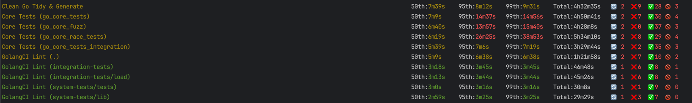

# Analyzing CI Runs

We offer a straightforward CLI tool designed to analyze CI runs, focusing on Jobs and Steps, to provide deeper insights into system-level tests.



## What to look for

Check execution times, results are sorted by `median`.

We exclude any runs without `conclusion` or if they have `conclusion: "skipped"`.

🔄 - if you see high numbers here it means your pipeline is flaky, and it does not pass from the first attempt on some commits. It may indicate test flakiness!

🚫 - if numbers are high there it means your pipeline is constantly `cancelled` so it wastes time without bringing any results/value!

## Examples
```
# GITHUB_TOKEN must have access to "actions" API
export GITHUB_TOKEN=...

# E2E test jobs from core for the last day
ctf ci -r "smartcontractkit/chainlink" -w "CI Core" -t jobs

# E2E test steps from core for the last day
ctf ci -r "smartcontractkit/chainlink" -w "CI Core" -t steps

# E2E tests from core for the last week (1k jobs limit!)
ctf ci -r "smartcontractkit/chainlink" -w "CI Core" -t jobs -s 7

# E2E tests from core for some specific days from 5 days ago to 3 days ago
ctf ci -r "smartcontractkit/chainlink" -w "CI Core" -t jobs -s 5 -e 3

# Last 3 days runs for e2e framework tests
ctf ci -r "smartcontractkit/chainlink-testing-framework" -w "Framework Golden Tests Examples" -t jobs -s 3
```
You can also use `-debug` flag to dump all the workflow runs/jobs to `ctf-ci-debug` folder.

All the results are also saved by default into `ctf-ci-$uuid.json` files so you can use this tool as CI performance linter.
