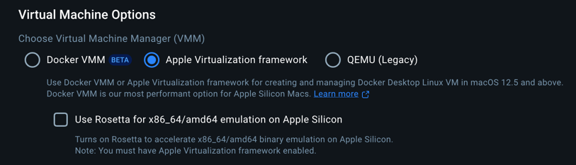

# Aptos Blockchain Client

You need to turn `Rosetta` off to use this image! Image doesn't work with `OrbStack` currently.

Docker Desktop



Default image is `aptoslabs/tools:aptos-node-v1.18.0`

API is available on [localhost:8080](http://localhost:8080/v1)

## Configuration

```toml
[blockchain_a]
  type = "aptos"
  image = "aptoslabs/tools:aptos-node-v1.18.0" # or aptoslabs/tools:nightly
  contracts_dir = "$your_dir"
  # expose custom ports, by default 8080 is API and 8081 is faucet
  custom_ports = ["9080:8080", "9081:9081"]
  # add command params
  docker_cmd_params = ["--skip-metadata-apply"]
```

## Usage

```golang
package examples

import (
	"github.com/go-resty/resty/v2"
	"github.com/smartcontractkit/chainlink-testing-framework/framework"
	"github.com/smartcontractkit/chainlink-testing-framework/framework/components/blockchain"
	"github.com/stretchr/testify/require"
	"testing"
)

type CfgAptos struct {
	BlockchainA *blockchain.Input `toml:"blockchain_a" validate:"required"`
}

func TestAptosSmoke(t *testing.T) {
	in, err := framework.Load[CfgAptos](t)
	require.NoError(t, err)

	bc, err := blockchain.NewBlockchainNetwork(in.BlockchainA)
	require.NoError(t, err)

	// execute any additional commands, to deploy contracts or set up
	// network is already funded, here are the keys
	_ = blockchain.DefaultAptosAccount
	_ = blockchain.DefaultAptosPrivateKey

	_, err = framework.ExecContainer(bc.ContainerName, []string{"ls", "-lah"})
	require.NoError(t, err)

	t.Run("test something", func(t *testing.T) {
		// use internal URL to connect Chainlink nodes
		_ = bc.Nodes[0].InternalHTTPUrl
		// use host URL to interact
		_ = bc.Nodes[0].ExternalHTTPUrl
		r := resty.New().SetBaseURL(bc.Nodes[0].ExternalHTTPUrl).EnableTrace()
		_, err := r.R().Get("/v1/transactions")
		require.NoError(t, err)
	})
}
```

## Test Private Keys

Default account is already funded with `100000000 Octas`

```
	Account: 0xa337b42bd0eecf8fb59ee5929ea4541904b3c35a642040223f3d26ab57f59d6e
	PrivateKey: 0xd477c65f88ed9e6d4ec6e2014755c3cfa3e0c44e521d0111a02868c5f04c41d4
```
