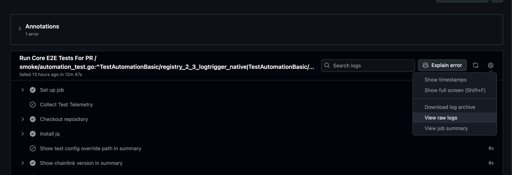

# Debugging CI Runs

Combining test and container logs for debugging in CI can be cumbersome, so we’ve simplified the process with a command that downloads, unzips, and uploads them to a local Loki instance, enabling you to leverage the full power of LogQL.

Spin up the stack and upload some data
```
ctf obs u
```

## Raw logs from GitHub step URL

Go to your test run and get the raw logs URL


```
ctf obs l -u "$your_url"
```
Click the resulting URL after upload is finished to open the filter

## Logs from GHA artifacts

Get the `Run ID` from GitHub UI, ex `actions/runs/$run_id`, download the artifact (in case of `CTFv2` it'd be just one dir), then run
```
gh run download $run_id
ctf obs l -d $artifact_dir
```
Click the resulting URL after upload is finished to open the filter


