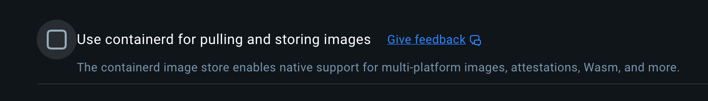

# Troubleshooting

## Can't start `ctf obs u`
```
Error response from daemon: error while creating mount source path '/host_mnt/Users/fsldkfs/Downloads/compose/conf/provisioning/dashboards/cadvisor/cadvisor.json': mkdir /host_mnt/Users/sdfjskj/Downloads/compose/conf/provisioning: operation not permitted
exit status 1
```

#### Solution
Enable Docker to access your directory
```
Docker Desktop -> Settings -> Resources -> File Sharing
```


## Can't run `anvil`, issue with `Rosetta`
```
2024/11/27 15:20:27 ⏳ Waiting for container id 79f8a68c07cc image: f4hrenh9it/foundry:latest. Waiting for: &{Port:8546 timeout:0x14000901278 PollInterval:100ms skipInternalCheck:false}
2024/11/27 15:20:27 container logs (all exposed ports, [8546/tcp], were not mapped in 5s: port 8546/tcp is not mapped yet
wait until ready: check target: retries: 1, port: "", last err: container exited with code 133):
rosetta error: Rosetta is only intended to run on Apple Silicon with a macOS host using Virtualization.framework with Rosetta mode enabled
```
#### Solution

Update your docker to `Docker version 27.3.1, build ce12230`

## Can't see any docker metrics with Cadvisor

Cadvisor container can't mount some layers
```
E1209 13:14:49.908130       1 manager.go:1116] Failed to create existing container: /docker/aa40875c382af890861447fa8aaf6908978041b9077bb81029971d23929f8c4d: failed to identify the read-write layer ID for container "aa40875c382af890861447fa8aaf6908978041b9077bb81029971d23929f8c4d". - open /rootfs/var/lib/docker/image/overlayfs/layerdb/mounts/aa40875c382af890861447fa8aaf6908978041b9077bb81029971d23929f8c4d/mount-id: no such file or directory
```

Disable `containerd` images ( Settings -> General ), see [issue](https://github.com/google/cadvisor/pull/3569).


