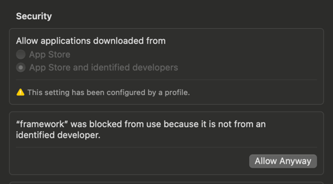

# 🚀 Getting started

## Prerequisites
- `Docker` [OrbStack](https://orbstack.dev/) or [Docker Desktop](https://www.docker.com/products/docker-desktop/), we recommend OrbStack (faster, smaller memory footprint)
- [Golang](https://go.dev/doc/install)

Tested with
```
Docker version 27.3.1
OrbStack Version: 1.8.2 (1080200)
```

## Test setup

To start writing tests create a directory for your project with `go.mod` and add a package
```
go get github.com/smartcontractkit/chainlink-testing-framework/framework
```

Download our [CLI](https://github.com/smartcontractkit/chainlink-testing-framework/releases/tag/framework%2Fv0.1.8)

OS X `arm64` (M1/M2/M3 MacBooks)
```
curl -L https://github.com/smartcontractkit/chainlink-testing-framework/releases/download/framework%2F<!-- cmdrun git describe --tags --match "framework/v[0-9]*.[0-9]*.[0-9]*" --abbrev=0 | sed 's/^framework\///' -->/framework-<!-- cmdrun git describe --tags --match "framework/v[0-9]*.[0-9]*.[0-9]*" --abbrev=0 | sed 's/^framework\///' -->-darwin-arm64.tar.gz | tar -xz
```

OS X `amd64` (old Intel chips)
```
curl -L https://github.com/smartcontractkit/chainlink-testing-framework/releases/download/framework%2F<!-- cmdrun git describe --tags --match "framework/v[0-9]*.[0-9]*.[0-9]*" --abbrev=0 | sed 's/^framework\///' -->/framework-<!-- cmdrun git describe --tags --match "framework/v[0-9]*.[0-9]*.[0-9]*" --abbrev=0 | sed 's/^framework\///' -->-darwin-amd64.tar.gz | tar -xz
```
Linux `arm64`
```
curl -L https://github.com/smartcontractkit/chainlink-testing-framework/releases/download/framework%2F<!-- cmdrun git describe --tags --match "framework/v[0-9]*.[0-9]*.[0-9]*" --abbrev=0 | sed 's/^framework\///' -->/framework-<!-- cmdrun git describe --tags --match "framework/v[0-9]*.[0-9]*.[0-9]*" --abbrev=0 | sed 's/^framework\///' -->-linux-arm64.tar.gz | tar -xz
```

Linux `amd64`
```
curl -L https://github.com/smartcontractkit/chainlink-testing-framework/releases/download/framework%2F<!-- cmdrun git describe --tags --match "framework/v[0-9]*.[0-9]*.[0-9]*" --abbrev=0 | sed 's/^framework\///' -->/framework-<!-- cmdrun git describe --tags --match "framework/v[0-9]*.[0-9]*.[0-9]*" --abbrev=0 | sed 's/^framework\///' -->-linux-amd64.tar.gz | tar -xz
```

Allow it to run in `System Settings -> Security Settings` (OS X)




Create an `.envrc` file and do `source .envrc` (we recommend to use [direnv](https://direnv.net/), so you don't need to load it every time)
```
export TESTCONTAINERS_RYUK_DISABLED=true # do not remove containers while we develop locally
```

Now you are ready to write your [first test](./first_test.md)

## Tools setup (Optional)

This setup is optional, and it explains how to create a local observability stack for on-chain and off-chain components.

Spin up your local obserability stack (Grafana LGTM)
```
ctf obs up
```
More [docs](observability/observability_stack.md)

Spin up your `Blockscout` stack
```
ctf bs up
```
More [docs](observability/blockscout.md)