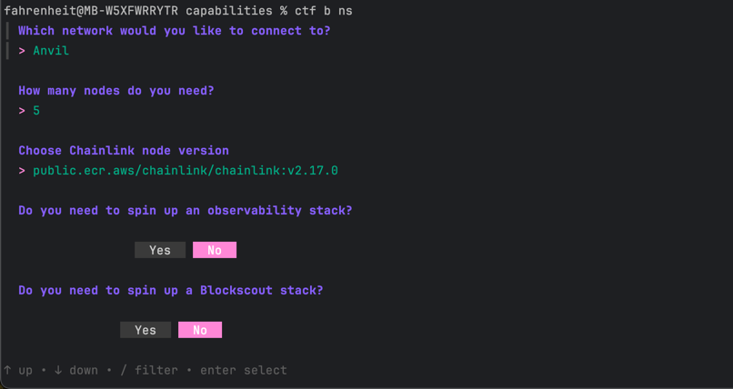

# Interactive


For non-technical users or those building with Chainlink products outside of Golang, we offer an interactive method to deploy a NodeSet.

If you're on OS X, we recommend to use [OrbStack](https://orbstack.dev/), otherwise [Docker Desktop](https://www.docker.com/products/docker-desktop/)

Download our [CLI](https://github.com/smartcontractkit/chainlink-testing-framework/releases/tag/framework%2Fv0.1.8)

OS X `arm64` (M1/M2/M3 MacBooks)
```
curl -L https://github.com/smartcontractkit/chainlink-testing-framework/releases/download/framework%2F<!-- cmdrun git describe --tags --match "framework/v[0-9]*.[0-9]*.[0-9]*" --abbrev=0 | sed 's/^framework\///' -->/framework-<!-- cmdrun git describe --tags --match "framework/v[0-9]*.[0-9]*.[0-9]*" --abbrev=0 | sed 's/^framework\///' -->-darwin-arm64.tar.gz | tar -xz
```

OS X `amd64` (old Intel chips)
```
curl -L https://github.com/smartcontractkit/chainlink-testing-framework/releases/download/framework%2F<!-- cmdrun git describe --tags --match "framework/v[0-9]*.[0-9]*.[0-9]*" --abbrev=0 | sed 's/^framework\///' -->/framework-<!-- cmdrun git describe --tags --match "framework/v[0-9]*.[0-9]*.[0-9]*" --abbrev=0 | sed 's/^framework\///' -->-darwin-amd64.tar.gz | tar -xz
```
Linux `arm64`
```
curl -L https://github.com/smartcontractkit/chainlink-testing-framework/releases/download/framework%2F<!-- cmdrun git describe --tags --match "framework/v[0-9]*.[0-9]*.[0-9]*" --abbrev=0 | sed 's/^framework\///' -->/framework-<!-- cmdrun git describe --tags --match "framework/v[0-9]*.[0-9]*.[0-9]*" --abbrev=0 | sed 's/^framework\///' -->-linux-arm64.tar.gz | tar -xz
```

Linux `amd64`
```
curl -L https://github.com/smartcontractkit/chainlink-testing-framework/releases/download/framework%2F<!-- cmdrun git describe --tags --match "framework/v[0-9]*.[0-9]*.[0-9]*" --abbrev=0 | sed 's/^framework\///' -->/framework-<!-- cmdrun git describe --tags --match "framework/v[0-9]*.[0-9]*.[0-9]*" --abbrev=0 | sed 's/^framework\///' -->-linux-amd64.tar.gz | tar -xz
```

Allow it to run in `System Settings -> Security Settings` (OS X)


```
./ctf b ns
```
Use `Tab/Shift+Tab` to select an option, use `<-`, `->` to change the option, `enter` to submit.

Press `Ctrl+C` to remove the services.

