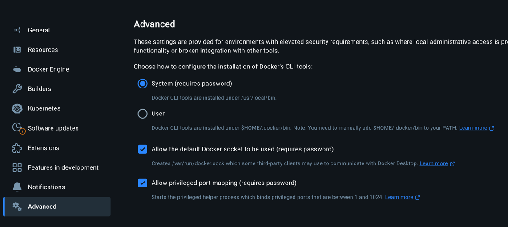

# Local Observability Stack

You can use a local observability stack, framework is connected to it by default

Default mode includes:
- Prometheus
- Loki
- OTEL-collector
- Grafana
```bash
# start the observability stack
ctf obs up
# remove the stack with all the data (volumes)
ctf obs d
# restart the stack removing all the data (volumes)
ctf obs r
```

Full stack has all the services above but also adds:
- Cadvisor
- Tempo
- Pyroscope
- PostgreSQL exporters for NodeSet databases

```bash
# start the observability stack
ctf obs up -f
# remove the stack with all the data (volumes)
ctf obs d -f
# restart the stack removing all the data (volumes)
ctf obs r -f
```

Read more about how to check [logs](logs.md) and [profiles](profiling.md)

## Developing

Change compose files under `framework/cmd/observability` and restart the stack (removing volumes too)
```
just reload-cli && ctf obs r
```

## Local Dashboards (Docker)

You can create a dashboard using [UI](http://localhost:3000) and put them under `$pwd/dashboards` folder then commit, they'll be loaded automatically on start and you can find them [here](http://localhost:3000/dashboards) under `local` directory.

`$pwd` is you current working directory from which you call `ctf obs u`

## Troubleshooting

### `cadvisor` is not working
Make sure your `Advanced` Docker settings look like this


