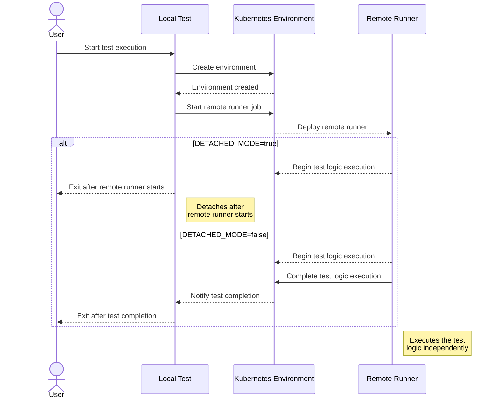

# Kubernetes - Using Remote Runner

In this chapter, we explain how to run a test in `k8s` and the changes required in the test logic to support it.

---

## Overview

The general process of running tests with a `remote runner` involves:

1. Creating a `k8s` environment from a local machine (either your local machine or a CI runner).
    - The environment launches a `remote runner` using the `ENV_JOB_IMAGE` environment variable.
2. The `remote runner` re-executes the same test code from the beginning.
    - It detects that the environment is already deployed and skips redeploying it.
3. After the `remote runner` completes its test execution, control returns to the local test execution.
    - The local test exits early to prevent duplicate execution.
4. If running in `detached mode`, control returns to the local test as soon as the remote test starts.
    - The local test exits immediately.
    - The `remote runner` continues running in `k8s` until the test completes.

Following diagram explains it in a visual way:


Although this may seem complex, the necessary changes to the test logic ensure that tests execute correctly without duplications. In the following steps, we explain where and why you should add conditionals and early exits to prevent unwanted re-execution.

> [!NOTE]
> We are developing a new `k8s` test runner that eliminates the need for `k8s`-specific logic. This will allow tests to run seamlessly both locally and remotely. Documentation for this is available [here](../../k8s-test-runner/k8s-test-runner.md).

---

## Requirements

The `remote runner` requires a Docker image containing your test code. There are multiple ways to build this image, some of which are automated in our repositories. For this documentation, we will build it from scratch.

> [!NOTE]
> The CTF repository builds a base testing image for each release using [this action](https://github.com/smartcontractkit/chainlink-testing-framework/actions/workflows/k8s-publish-test-base-image.yaml). This base image includes `kubectl`, `helm`, and other dependencies. Use it as a base image for your final test image. You only need to copy your compiled Go tests and set the entrypoint to execute them. An example from the Chainlink repository can be found [here](https://github.com/smartcontractkit/chainlink/actions/workflows/on-demand-ocr-soak-test.yml).

---

## Step 1: Build a Docker Image with Your Tests

Define a `Dockerfile`:

```dockerfile
# Base image for all k8s test runs
FROM golang:1.23-bullseye

ARG GOARCH
ARG GOOS
ARG BASE_URL
ARG HELM_VERSION
ARG HOME
ARG KUBE_VERSION
ARG NODE_VERSION

# Compile Go binary targeting linux/amd64, used by k8s runners
ENV GOOS="linux"
ENV GOARCH="amd64"
ENV BASE_URL="https://get.helm.sh"
ENV HELM_VERSION="3.10.3"
ENV KUBE_VERSION="v1.25.5"
ENV NODE_VERSION=18

# Install dependencies
RUN apt-get update && apt-get install -y \
    ca-certificates wget curl git gnupg zip && \
    mkdir -p /etc/apt/keyrings && \
    curl -fsSL https://deb.nodesource.com/gpgkey/nodesource-repo.gpg.key | gpg --dearmor -o /etc/apt/keyrings/nodesource.gpg && \
    echo "deb [signed-by=/etc/apt/keyrings/nodesource.gpg] https://deb.nodesource.com/node_$NODE_VERSION.x nodistro main" | tee /etc/apt/sources.list.d/nodesource.list && \
    apt-get update && apt-get install -y nodejs && \
    curl -LO https://storage.googleapis.com/kubernetes-release/release/$(curl -s https://storage.googleapis.com/kubernetes-release/release/stable.txt)/bin/linux/amd64/kubectl && \
    chmod +x ./kubectl && mv ./kubectl /usr/local/bin && \
    ARCH=$(uname -m | sed 's/x86_64/amd64/;s/aarch64/arm64/') && \
    wget ${BASE_URL}/helm-v${HELM_VERSION}-linux-${ARCH}.tar.gz -O - | tar -xz && \
    mv linux-${ARCH}/helm /usr/bin/helm && chmod +x /usr/bin/helm && rm -rf linux-${ARCH} && \
    npm install -g yarn && apt-get clean && \
    helm repo add chainlink-qa https://raw.githubusercontent.com/smartcontractkit/qa-charts/gh-pages/ && \
    helm repo add bitnami https://charts.bitnami.com/bitnami && helm repo update

# Install AWS CLI v2
RUN ARCH=$(uname -m | sed 's/x86_64/x86_64/;s/aarch64/aarch64/') && \
    curl https://awscli.amazonaws.com/awscli-exe-linux-${ARCH}.zip -o "awscliv2.zip" && \
    unzip awscliv2.zip && ./aws/install && rm -rf awscliv2.zip

COPY lib/ testdir/

# Compile Go tests
WORKDIR /go/testdir/k8s/examples/link
RUN go test -c . -o link

# Entrypoint to run tests
ENTRYPOINT ["./link"]
```

**Installed Dependencies:**
- `kubectl` (to interact with `k8s`)
- `nodejs`
- `helm` (for environment setup)
- `AWS CLI v2` (if interacting with AWS `k8s` clusters)

> [!NOTE]
> If using local Helm charts instead of published ones, set `LOCAL_CHARTS=true`. Local here means onces stored in the Docker image
> in the `lib/charts` folder.

---

## Step 2: Build the Image

Build the Docker image from the root directory of the CTF repository:

```bash
docker build -f lib/k8s/examples/link/Dockerfile \
    --platform=linux/amd64 \
    -t link-test:latest .
```

> [!NOTE]
> The `--platform=linux/amd64` parameter ensures compatibility with k8s runners.

---

## Step 3: Test the Image

Before modifying the test logic for `remote runner` compatibility, test the image locally. Ensure you have access to a `k8s` cluster (local or remote). Configure `kubectl` to use the cluster and authenticate if necessary.

Run the test image:

```bash
docker run \
    --rm \
    -v ~/.aws:/root/.aws:ro \
    -v ~/.kube/config:/root/.kube/config:ro \
    -e AWS_PROFILE=<your-profile> \
    -e KUBECONFIG=/root/.kube/config \
    link-test:latest
```

This mounts the local `.aws` directory and `kubectl` configuration to the container, allowing it to access the cluster. Verify the test completes successfully.

---

## Step 4: Make the Test `Remote Runner`-Compatible

To adapt the test for `remote runner` execution, you need to divide the test logic into:

1. **Local Execution Logic**: Responsible for setting up the environment and initiating the `remote runner`.
2. **Remote Execution Logic**: Handles the actual test operations, such as deploying contracts or generating workload.

### Key Adjustments

- **Check for Remote Execution**: Use the `testEnv.WillUseRemoteRunner()` function to determine if the test will run in the `remote runner`. If it will, ensure any non-idempotent operations, like test logic execution, are skipped in the local context.
- **Prevent Test Logic Duplication**: Exit the local test execution after initiating the remote runner to avoid running the test logic both locally and remotely.

### Updated Example

Here is how you can make these changes:

```go
err = testEnv.Run()
if err != nil {
    t.Fatal("Error running environment: ", err)
}

if testEnv.WillUseRemoteRunner() {
    log.Info().Msg("Stopping local execution as test will continue in the remote runner")
    return // Exit early to allow the remote runner to take over
}

// Additional test logic (if applicable) runs only in the remote runner
```

### Why These Changes Are Necessary

- **Environment Duplication**: Ensures that test logic is executed only once, within the `remote runner`, and not both locally and remotely.

---

## Step 5: Rebuild the image
Rebuild the image to include `remote runner`-related changes.

## Step 6: Push Image to Registry (Optional)

If using a remote cluster, push the image to a registry like AWS ECR:

```bash
aws ecr get-login-password --region <AWS_REGION> | docker login \
    --username AWS --password-stdin <AWS_ACCOUNT>.dkr.ecr.<AWS_REGION>.amazonaws.com

docker tag link-test:latest \
    <AWS_ACCOUNT>.dkr.ecr.<AWS_REGION>.amazonaws.com/<AWS_REPOSITORY>/link-remote-runner-test:latest

docker push <AWS_ACCOUNT>.dkr.ecr.<AWS_REGION>.amazonaws.com/<AWS_REPOSITORY>/link-remote-runner-test:latest
```

---

## Step 7: Run with `Remote Runner`

Run the test in `detached mode` by setting these environment variables:
- `DETACH_RUNNER=true`
- `ENV_JOB_IMAGE=<image-url>` (one we created in step 5)

Command:

```bash
docker run \
    --rm \
    -v ~/.aws:/root/.aws:ro \
    -v ~/.kube/config:/root/.kube/config:ro \
    -e DETACH_RUNNER=true \
    -e ENV_JOB_IMAGE=<image-url> \
    -e AWS_PROFILE=<your-profile> \
    -e KUBECONFIG=/root/.kube/config \
    <image-url>
```

> [!NOTE]
> You may also need to pass secrets to your test. Refer to the [Test Secrets Documentation](./test_secrets.md) for guidance on securely managing and injecting secrets into your tests.

The local test detaches after starting the remote runner. Logs from the remote runner can be checked for test progress.

---

You can find the complete example [here](https://github.com/smartcontractkit/chainlink-testing-framework/tree/main/lib/k8s/examples/link).

