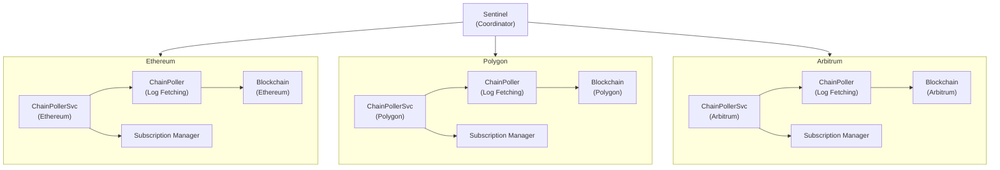

# Sentinel

**🚧 Beta Notice:** Sentinel is currently in **Beta** mode. The API is **subject to change**, and users are advised to stay updated with the latest releases and documentation.

## Table of Contents

- [Overview](#overview)
- [Key Features](#key-features)
- [System Architecture](#system-architecture)
  - [How Components Interact](#how-components-interact)
  - [Core Components](#core-components)
- [Usage](#usage)
  - [Initialize Sentinel](#initialize-sentinel)
  - [Add a Chain](#add-a-chain)
  - [Subscribe to Events](#subscribe-to-events)
  - [Unsubscribe](#unsubscribe)
  - [Remove a Chain](#remove-a-chain)
- [API Reference](#api-reference)
  - [Sentinel](#sentinel)
- [Testing](#testing)
  - [Run Tests](#run-tests)

## Overview

Sentinel is a centralized orchestrator that manages multiple blockchain poller services, each responsible for a specific blockchain network (e.g., Ethereum, Optimism, Arbitrum). It provides a unified interface for subscribing to blockchain events, ensuring efficient log polling and event broadcasting to subscribers.

## Key Features

- **Multi-Chain Support**: Manage multiple blockchain networks concurrently.
- **Event Broadcasting**: Relay blockchain events to subscribers via a thread-safe subscription system.
- **Flexible Subscriptions**: Dynamically subscribe and unsubscribe to events based on addresses and topics.
- **Graceful Lifecycle Management**: Start, stop, and clean up resources across services effortlessly.
- **Comprehensive Testing**: Ensures reliability through extensive unit and integration tests.
- **Scalable Architecture**: Designed to handle polling multiple chains with multiple users subscribed to multiple events.

## System Architecture

### How Components Interact



### Core Components

1. **Sentinel**:
   - **Role**: Central coordinator managing multiple `ChainPollerService` instances.
   - **Visibility**: External
   - **Responsibilities**:
     - Handles adding and removing blockchain chains.
     - Manages global subscriptions.
     - Orchestrates communication between components.

2. **ChainPollerService**:
   - **Role**: Manages the polling process for a specific blockchain.
   - **Visibility**: Internal
   - **Responsibilities**:
     - Polls blockchain logs based on filter queries.
     - Integrates internal `ChainPoller` and `SubscriptionManager`.
     - Broadcasts fetched logs to relevant subscribers.

3. **ChainPoller**:
   - **Role**: Fetches logs from blockchain networks.
   - **Visibility**: Internal
   - **Responsibilities**:
     - Interacts with the blockchain client to retrieve logs.
     - Processes filter queries to fetch relevant logs.

4. **SubscriptionManager**:
   - **Role**: Manages event subscriptions for a specific chain.
   - **Visibility**: Internal
   - **Responsibilities**:
     - Tracks subscriptions to blockchain events.
     - Ensures thread-safe management of subscribers.
     - Broadcasts logs to all relevant subscribers.

## Usage

### Initialize Sentinel

Set up a `Sentinel` instance:

```go
package main

import (
    "github.com/rs/zerolog"
    "os"

    "github.com/smartcontractkit/chainlink-testing-framework/sentinel"
)

func main() {
    // Initialize logger
    logger := zerolog.New(os.Stdout).With().Timestamp().Logger()

    // Initialize Sentinel
    sentinelCoordinator := sentinel.NewSentinel(sentinel.SentinelConfig{
        Logger: &logger,
    })
    defer sentinelCoordinator.Close()
}
```

### Add a Chain

Add a blockchain to monitor:

```go
package main

import (
    "time"

    "github.com/ethereum/go-ethereum/ethclient"
    "github.com/smartcontractkit/chainlink-testing-framework/sentinel/blockchain_client_wrapper"
    "github.com/smartcontractkit/chainlink-testing-framework/sentinel/sentinel"
)

func main() {
    // Initialize logger and Sentinel as shown above

    // Setup blockchain client (e.g., Geth)
    client, err := ethclient.Dial("https://mainnet.infura.io/v3/YOUR-PROJECT-ID")
    if err != nil {
        panic("Failed to connect to blockchain client: " + err.Error())
    }
    wrappedClient := blockchain_client_wrapper.NewGethClientWrapper(client)

    // Add a new chain to Sentinel
    err = sentinelCoordinator.AddChain(sentinel.AddChainConfig{
        ChainID:          1, // Ethereum Mainnet
        PollInterval:     10 * time.Second,
        BlockchainClient: wrappedClient,
    })
    if err != nil {
        panic("Failed to add chain: " + err.Error())
    }
}
```

### Subscribe to Events

Subscribe to blockchain events:

```go
package main

import (
    "fmt"

    "github.com/ethereum/go-ethereum/common"
    "github.com/smartcontractkit/chainlink-testing-framework/sentinel/api"
)

func main() {
    // Initialize logger, Sentinel, and add a chain as shown above

    // Define the address and topic to subscribe to
    address := common.HexToAddress("0x1234567890abcdef1234567890abcdef12345678")
    topic := common.HexToHash("0xabcdefabcdefabcdefabcdefabcdefabcdefabcdef")

    // Subscribe to the event
    logCh, err := sentinelCoordinator.Subscribe(1, address, topic)
    if err != nil {
        panic("Failed to subscribe: " + err.Error())
    }
    defer sentinelCoordinator.Unsubscribe(1, address, topic, logCh)

    // Listen for logs in a separate goroutine
    go func() {
        for log := range logCh {
            fmt.Printf("Received log: %+v\n", log)
        }
    }()
}
```

### Unsubscribe

Unsubscribe from events:

```go
package main

func main() {
    // Initialize logger, Sentinel, add a chain, and subscribe as shown above

    // Assume logCh is the channel obtained from Subscribe
    err = sentinelCoordinator.Unsubscribe(1, address, topic, logCh)
    if err != nil {
        panic("Failed to unsubscribe: " + err.Error())
    }
}
```

### Remove a Chain

Remove a blockchain from monitoring:

```go
package main

func main() {
    // Initialize logger, Sentinel, add a chain, and subscribe as shown above

    // Remove the chain
    err = sentinelCoordinator.RemoveChain(1)
    if err != nil {
        panic("Failed to remove chain: " + err.Error())
    }
}
```

## API Reference

### Sentinel

- **`NewSentinel(config SentinelConfig) *Sentinel`**  
  Initializes a new Sentinel instance.

- **`AddChain(config AddChainConfig) error`**  
  Adds a new blockchain chain to Sentinel.

- **`RemoveChain(chainID int64) error`**  
  Removes an existing chain from Sentinel.

- **`Subscribe(chainID int64, address common.Address, topic common.Hash) (chan api.Log, error)`**  
  Subscribes to a specific event on a given chain.

- **`Unsubscribe(chainID int64, address common.Address, topic common.Hash, ch chan api.Log) error`**  
  Unsubscribes from a specific event.

## Testing

### Run Tests

Run the comprehensive test suite using:

```bash
go test -race ./... -v
```
