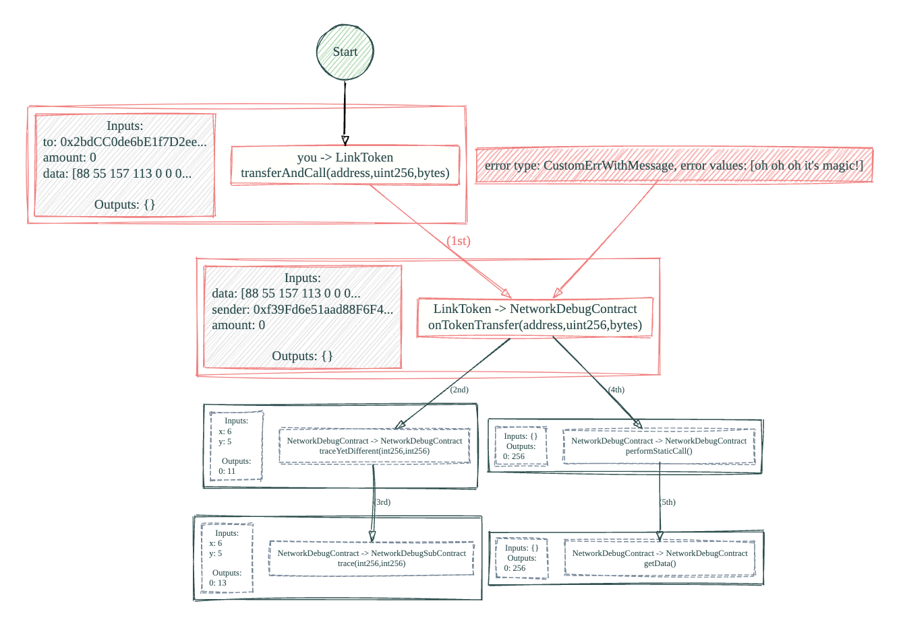

# Seth

Reliable and debug-friendly Ethereum client

[](https://goreportcard.com/report/github.com/smartcontractkit/chainlink-testing-framework/seth)
[](https://github.com/smartcontractkit/seth/actions/workflows/test_decode.yml)
[](https://github.com/smartcontractkit/seth/actions/workflows/test_trace.yml)
[](https://github.com/smartcontractkit/seth/actions/workflows/test_cli.yml)
[](https://github.com/smartcontractkit/seth/actions/workflows/test_api.yml)
[](https://github.com/smartcontractkit/seth/actions/workflows/test_cli.yml)
[](https://github.com/smartcontractkit/seth/actions/workflows/test_decode_testnet.yml)
<br/>

# Content

1. [Goals](#goals)
2. [Features](#features)
3. [Examples](#examples)
4. [Setup](#setup)
    1. [Building test contracts](#building-test-contracts)
    2. [Testing](#testing)
5. [Configuration](#config)
    1. [Simplified configuration](#simplified-configuration)
    2. [ClientBuilder](#clientbuilder)
        1. [Simulated Backend](#simulated-backend)
    3. [Supported env vars](#supported-env-vars)
    4. [TOML configuration](#toml-configuration)
6. [Automated gas price estimation](#automatic-gas-estimator)
7. [DOT Graphs of transactions](#dot-graphs)
8. [Using multiple private keys](#using-multiple-keys)
9. [Experimental features](#experimental-features)
10. [Gas bumping for slow transactions](#gas-bumping-for-slow-transactions)
11. [CLI](#cli)
12. [Manual gas price estimation](#manual-gas-price-estimation)
13. [Block Stats](#block-stats)
14. [Single transaction tracing](#single-transaction-tracing)
15. [Bulk transaction tracing](#bulk-transaction-tracing)
16. [RPC traffic logging](#rpc-traffic-logging)
17. [Read-only mode](#read-only-mode)
18. [ABI Finder](#abi-finder)
19. [Contract Map](#contract-map)
20. [Contract Store](#contract-store)

## Goals

- Be a thin, debuggable and battle tested wrapper on top of `go-ethereum`
- Decode all transaction inputs/outputs/logs for all ABIs you are working with, automatically
- Simple synchronous API
- Do not handle `nonces` on the client side, trust the server
- Do not wrap `bind` generated contracts, small set of additional debug API
- Resilient: should execute transactions even if there is a gas spike or an RPC outage (failover)
- Well tested: should provide a suite of e2e tests that can be run on testnets to check integration

## Features

- [x] Decode named inputs
- [x] Decode named outputs
- [x] Decode anonymous outputs
- [x] Decode logs
- [x] Decode indexed logs
- [x] Decode old string reverts
- [x] Decode new typed reverts
- [x] EIP-1559 support
- [x] Multi-keys client support
- [x] CLI to manipulate test keys
- [x] Simple manual gas price estimation
- [ ] Fail over client logic
- [x] Decode collided event hashes
- [x] Tracing support (4byte)
- [x] Tracing support (callTracer)
- [ ] Tracing support (prestate)
- [x] Tracing decoding
- [x] Tracing tests
- [x] More tests for corner cases of decoding/tracing
- [x] Saving of deployed contracts mapping (`address -> ABI_name`) for live networks
- [x] Reading of deployed contracts mappings for live networks
- [x] Automatic gas estimator (experimental)
- [x] Block stats CLI
- [x] Check if address has a pending nonce (transaction) and panic if it does
- [x] DOT graph output for tracing
- [x] Gas bumping for slow transactions

You can read more about how ABI finding and contract map works [here](../../../seth/docs/abi_finder_contract_map.md) and about contract store here [here](../../../seth/docs/contract_store.md).

## Examples

Check [examples](https://github.com/smartcontractkit/chainlink-testing-framework/tree/main/seth/examples) folder

Lib provides a small amount of helpers for decoding handling that you can use with vanilla `go-ethereum` generated wrappers

```golang
// Decode waits for transaction and decode all the data/errors
Decode(tx *types.Transaction, txErr error) (*DecodedTransaction, error)

// NewTXOpts returns a new sequential transaction options wrapper,
// sets opts.GasPrice and opts.GasLimit from seth.toml or override with options
NewTXOpts(o ...TransactOpt) *bind.TransactOpts

// NewCallOpts returns a new call options wrapper
NewCallOpts(o ...CallOpt) *bind.CallOpts
```

By default, we are using the `root` key `0`, but you can also use any of the private keys passed as part of `Network` configuration in `seth.toml` or ephemeral keys.

```golang
// NewCallKeyOpts returns a new sequential call options wrapper from the key N
NewCallKeyOpts(keyNum int, o ...CallOpt) *bind.CallOpts

// NewTXKeyOpts returns a new transaction options wrapper called from the key N
NewTXKeyOpts(keyNum int, o ...TransactOpt) *bind.TransactOpts
```

Start `Geth` in a separate terminal, then run the examples

```sh
make GethSync
cd examples
go test -v
```

## Setup

We are using [nix](https://nixos.org/)

Enter the shell

```sh
nix develop
```

## Building test contracts

We have `go-ethereum` and [foundry](https://github.com/foundry-rs/foundry) tools inside `nix` shell

```sh
make build
```

## Testing

To run tests on a local network, first start it

```sh
make AnvilSync
```

Or use latest `Geth`

```sh
make GethSync
```

You can use default `hardhat` key `ac0974bec39a17e36ba4a6b4d238ff944bacb478cbed5efcae784d7bf4f2ff80` to run tests

Run the [decode](../../../seth/client_decode_test.go) tests

```sh
make network=Anvil root_private_key=ac0974bec39a17e36ba4a6b4d238ff944bacb478cbed5efcae784d7bf4f2ff80 test
make network=Geth root_private_key=ac0974bec39a17e36ba4a6b4d238ff944bacb478cbed5efcae784d7bf4f2ff80 test
```

Check other params in [seth.toml](../../../seth/seth.toml), select any network and use your key for testnets

User facing API tests are [here](../../../seth/client_api_test.go)

```sh
make network=Anvil root_private_key=ac0974bec39a17e36ba4a6b4d238ff944bacb478cbed5efcae784d7bf4f2ff80 test_api
make network=Geth root_private_key=ac0974bec39a17e36ba4a6b4d238ff944bacb478cbed5efcae784d7bf4f2ff80 test_api
```

CLI tests

```sh
make network=Anvil root_private_key=ac0974bec39a17e36ba4a6b4d238ff944bacb478cbed5efcae784d7bf4f2ff80 test_cli
make network=Geth root_private_key=ac0974bec39a17e36ba4a6b4d238ff944bacb478cbed5efcae784d7bf4f2ff80 test_cli
```

Tracing tests

```sh
make network=Anvil root_private_key=ac0974bec39a17e36ba4a6b4d238ff944bacb478cbed5efcae784d7bf4f2ff80 test_trace
make network=Geth root_private_key=ac0974bec39a17e36ba4a6b4d238ff944bacb478cbed5efcae784d7bf4f2ff80 test_trace
```

# Config

### Simplified configuration

If you do not want to set all the parameters, you can use a simplified progammatical configuration. Here's an example:

```golang
cfg := seth.DefaultConfig("ws://localhost:8546", []string{"ac0974bec39a17e36ba4a6b4d238ff944bacb478cbed5efcae784d7bf4f2ff80"})
client, err := seth.NewClientWithConfig(cfg)
if err != nil {
    log.Fatal(err)
}
```

This config uses what we consider reasonable defaults, such as:

- 5 minute transaction confirmation timeout
- 1 minute RPC node dial timeout
- enabled EIP-1559 dynamic fees and automatic gas prices estimation (with 200 blocks history; will auto-disable itself if RPC doesn't support EIP-1559)
- tracing only of reverted transaction to console and DOT graphs
- checking of RPC node health on client creation
- no ephemeral keys

### ClientBuilder

You can also use a `ClientBuilder` to build a config programmatically. Here's an extensive example:

```golang
client, err := NewClientBuilder().
    // network
    WithNetworkName("my network").
	// if empty we will ask the RPC node for the chain ID
	WithNetworkChainId(1337).
    WithRpcUrl("ws://localhost:8546").
    WithPrivateKeys([]string{"ac0974bec39a17e36ba4a6b4d238ff944bacb478cbed5efcae784d7bf4f2ff80"}).
    WithRpcDialTimeout(10*time.Second).
    WithTransactionTimeouts(1*time.Minute).
    // addresses
    WithEphemeralAddresses(10, 10).
    // tracing
    WithTracing(seth.TracingLevel_All, []string{seth.TraceOutput_Console}).
    // protections
    WithProtections(true, true, seth.MustMakeDuration(2*time.Minute)).
    // artifacts folder
    WithArtifactsFolder("some_folder").
	// folder with gethwrappers for ABI decoding
    WithGethWrappersFolders([]string{"./gethwrappers/ccip", "./gethwrappers/keystone"}).
    // nonce manager
    WithNonceManager(10, 3, 60, 5).
    // EIP-1559 and gas estimations
    WithEIP1559DynamicFees(true).
    WithDynamicGasPrices(120_000_000_000, 44_000_000_000).
    // estimate gas prices based on the information from the RPC based on 10 last blocks
    // adjust the value to fast priority and 3 attempts to get the estimations
    WithGasPriceEstimations(true, 10, seth.Priority_Fast, 3).
    // gas bumping: retries, max gas price, bumping strategy function
    WithGasBumping(5, 100_000_000_000, PriorityBasedGasBumpingStrategyFn).
    Build()

if err != nil {
    log.Fatal(err)
}
```

By default, it uses the same values as simplified configuration, but you can override them by calling the appropriate methods. Builder includes only options
that we thought to be most useful, it's not a 1:1 mapping of all fields in the `Config` struct. Therefore, if you need to set some more advanced options, you should create the `Config` struct directly,
use TOML config or manually set the fields on the `Config` struct returned by the builder.

It' also possible to use the builder to create a new config from an existing one:

```golang
client, err := NewClientBuilderWithConfig(&existingConfig).
        UseNetworkWithChainId(1337).
        WithEIP1559DynamicFees(false).
	    Build()

if err != nil {
    log.Fatal(err)
}
```
This can be useful if you already have a config, but want to modify it slightly. This approach will only work if you pass it the full config, since it will not apply any defaults. It can also be useful if you read TOML config with multiple `Networks` and you want to specify which one you want to use. Although for that use case it's better to make use of the following approach:
```go
// assuming that "readSethNetworks" knows how to read the TOML file and convert it to []*seth.Network
/* example content of networks.toml:
[[networks]]
name = "Anvil"
dial_timeout = "1m"
transaction_timeout = "30s"
urls_secret = ["ws://localhost:8545"]
transfer_gas_fee = 21_000
gas_limit = 10_000_000
# legacy transactions
gas_price = 1_000_000_000
# EIP-1559 transactions
# disabled as it makes some of our tests fail
# eip_1559_dynamic_fees = true
gas_fee_cap = 1_000_000_000
gas_tip_cap = 1_000_000_000

[[networks]]
name = "Geth"
dial_timeout = "1m"
transaction_timeout = "30s"
urls_secret = ["ws://localhost:8546"]
transfer_gas_fee = 21_000
gas_limit = 8_000_000
# legacy transactions
gas_price = 1_000_000_000
# EIP-1559 transactions
# disabled as it makes some of our tests fail
# eip_1559_dynamic_fees = true
gas_fee_cap = 10_000_000_000
gas_tip_cap = 3_000_000_000
*/
networks, err := readSethNetworks("networks.toml")
if err != nil {
    log.Fatal(err)
}

client, err := NewClientBuilderWithConfig(&existingConfig).
        UseNetworkWithName("Anvil"). // or alternatively use UseNetworkWithChainId (if you defined it for you network)
	    Build()

if err != nil {
    log.Fatal(err)
}
```

### Simulated Backend

Last, but not least, `ClientBuilder` allows you to pass custom implementation of `simulated.Client` interface, which include Geth's [Simulated Backend](https://github.com/ethereum/go-ethereum/blob/master/ethclient/simulated/backend.go), which might be very useful for rapid testing against
in-memory environment. When using that option bear in mind that:
* passing RPC URL is not allowed and will result in error
* tracing is disabled

> [!NOTE]
> Simulated Backend doesn't support tracing, because it doesn't expose the JSON-RPC `Call(result interface{}, method string, args ...interface{})` method, which we use to fetch debug information.

So how do you use Seth with simulated backend?
```go
var startBackend := func(fundedAddresses []common.Address) (*simulated.Backend, context.CancelFunc) {
toFund := make(map[common.Address]types.Account)
	for _, address := range fundedAddresses {
		toFund[address] = types.Account{
			Balance: big.NewInt(1000000000000000000), // 1 Ether
		}
	}
	backend := simulated.NewBackend(toFund)

	ctx, cancelFn := context.WithCancel(context.Background())

    // 100ms block time
	ticker := time.NewTicker(100 * time.Millisecond)
	go func() {
		for {
			select {
			case <-ticker.C:
				backend.Commit()
			case <-ctx.Done():
				backend.Close()
				return
			}
		}
	}()

	return backend, cancelFn
}

// 0xf39fd6e51aad88f6f4ce6ab8827279cfffb92266 is the default dev account
backend, cancelFn := startBackend(
    []common.Address{common.HexToAddress("0xf39fd6e51aad88f6f4ce6ab8827279cfffb92266")},
)
defer func() { cancelFn() }()

client, err := builder.
    WithNetworkName("simulated").
    WithEthClient(backend.Client()).
    WithPrivateKeys([]string{"ac0974bec39a17e36ba4a6b4d238ff944bacb478cbed5efcae784d7bf4f2ff80"}).
    Build()

require.NoError(t, err, "failed to build client")
_ = client
```

> [!WARNING]
> When using `simulated.Backend` do remember that it doesn't automatically mine blocks. You need to call `backend.Commit()` manually
> to mine a new block and have your transactions processed. The best way to do it is having a goroutine running in the background
> that either mines at specific intervals or when it receives a message on channel.

### Hooks
Seth supports pre/post operation hooks for two functions:
* `DeployContract()`
* `Decode` (also `DecodeTx`)

As the name suggest each will be executed before and after mentioned operation. By default, no hooks are set. Adding hooks doesn't influence retry/gas bumping logic.

You can either set hooks directly on the `seth.Config` object (not recommended) or pass them to the `ClientBuilder`:
```go
// assuming backend is the simulated backend, to show how we can speed up contract deployments by calling `Commit()` right after deploying the contract
hooks := seth.Hooks{
    ContractDeployment: seth.ContractDeploymentHooks{
        Post: func(client *seth.Client, tx *types.Transaction) error {
            backend.Commit()
            return nil
        },
    },
}

client, err := builder.
    WithNetworkName("simulated").
    WithHooks(hooks).
    WithEthClient(backend.Client()).
    WithPrivateKeys([]string{"ac0974bec39a17e36ba4a6b4d238ff944bacb478cbed5efcae784d7bf4f2ff80"}).
    Build()

if err != nil {
    log.Fatal(err)
}
```

### Supported env vars

Some crucial data is stored in env vars, create `.envrc` and use `source .envrc`, or use `direnv`

```sh
export SETH_LOG_LEVEL=info # global logger level
export SETH_CONFIG_PATH=seth.toml # path to the toml config
export SETH_NETWORK=Geth # selected network
export SETH_ROOT_PRIVATE_KEY=ac0974bec39a17e36ba4a6b4d238ff944bacb478cbed5efcae784d7bf4f2ff80 # root private key

alias seth="SETH_CONFIG_PATH=seth.toml go run cmd/seth/seth.go" # useful alias for CLI
```

> Find the log level options [here](https://github.com/rs/zerolog?tab=readme-ov-file#leveled-logging)

Alternatively if you don't have a network defined in the TOML you can still use the CLI by providing these 2 key env vars:

```sh
export SETH_URL=https://rpc.fuji.testnet.anyswap.exchange
export SETH_CHAIN_ID=43113

go run cmd/seth/seth.go ... # your command
```

In that case you should still pass network name with `-n` flag.

### TOML configuration

Set up your ABI directory (relative to `seth.toml`)

```toml
abi_dir = "contracts/abi"
```

Setup your BIN directory (relative to `seth.toml`)

```toml
bin_dir = "contracts/bin"
```

Decide whether you want to generate any `ephemeral` keys:

```toml
# Set number of ephemeral keys to be generated (0 for no ephemeral keys). Each key will receive a proportion of native tokens from root private key's balance with the value equal to `(root_balance / ephemeral_keys_number) - transfer_fee * ephemeral_keys_number`.
ephemeral_addresses_number = 10
```

You can enable auto-tracing for all transactions meeting configured level, which means that every time you use `Decode()` we will decode the transaction and also trace all calls made within the transaction, together with all inputs, outputs, logs and events. Three tracing levels are available:

- `all` - trace all transactions
- `reverted` - trace only reverted transactions (that's default setting used if you don't set `tracing_level`)
- `none` - don't trace any transactions

Example:

```toml
tracing_level = "reverted"
```

Additionally, you can decide where tracing/decoding data goes to. There are three options:

- `console` - we will print all tracing data to the console
- `json` - we will save tracing data for each transaction to a JSON file
- `dot` - we will save tracing data for each transaction to a DOT file (graph)

```toml
trace_outputs = ["console", "json", "dot"]
```

For info on viewing DOT files please check the [DOT graphs](#dot-graphs) section below.

Example:

These two options should be used with care, when `tracing_level` is set to `all` as they might generate a lot of data.

If you want to check if the RPC is healthy on start, you can enable it with:

```toml
check_rpc_health_on_start = false
```

It will execute a simple check of transferring 10k wei from root key to root key and check if the transaction was successful.

You can also enable pending nonce protection that will check if given key has any pending transactions. By default, we will wait 1 minute for all transactions to be mined. If any of them is still pending, we will panic. You can enable it with:
```toml
pending_nonce_protection_enabled = true
pending_nonce_protection_timeout = "5m"
```

If you want to use HTTP instead of WS you can do so by setting to true:

```toml
force_http = false
```

You can add more networks like this:

```toml
[[Networks]]
name = "Fuji"
transaction_timeout = "30s"
# gas limit should be explicitly set only if you are connecting to a node that's incapable of estimating gas limit itself (should only happen for very old versions)
# gas_limit = 9_000_000
# hardcoded gas limit for sending funds that will be used if estimation of gas limit fails
transfer_gas_fee = 21_000
# legacy transactions
gas_price = 1_000_000_000
# EIP-1559 transactions
eip_1559_dynamic_fees = true
gas_fee_cap = 25_000_000_000
gas_tip_cap = 1_800_000_000
urls_secret = ["..."]
# if set to true we will dynamically estimate gas for every transaction (explained in more detail below)
gas_price_estimation_enabled = true
# how many last blocks to use, when estimating gas for a transaction
gas_price_estimation_blocks = 1000
# priority of the transaction, can be "fast", "standard" or "slow" (the higher the priority, the higher adjustment factor and buffer will be used for gas estimation) [default: "standard"]
gas_price_estimation_tx_priority = "slow"
```

If you don't we will use the default settings for `Default` network.

ChainID is not needed, as it's fetched from the node.

If you want to save addresses of deployed contracts, you can enable it with:

```toml
save_deployed_contracts_map = true
```

If you want to re-use previously deployed contracts you can indicate file name in `seth.toml`:

```toml
contract_map_file = "deployed_contracts_mumbai.toml"
```

Both features only work for live networks. Otherwise, they are ignored, and nothing is saved/read from for simulated networks.

### Automatic Gas Estimator

This section explains how to configure and understand the automatic gas estimator, which is crucial for executing transactions on Ethereum-based networks. Here’s what you need to know:

#### Configuration Requirements

Before using the automatic gas estimator, it's essential to set the default gas-related parameters for your network:

- **Non-EIP-1559 Networks**: Set the `gas_price` to define the cost per unit of gas if your network doesn't support EIP-1559.
- **EIP-1559 Networks**: If your network supports EIP-1559, set the following:
    - `eip_1559_dynamic_fees`: Enables dynamic fee structure.
    - `gas_fee_cap`: The maximum fee you're willing to pay per gas.
    - `gas_tip_cap`: An optional tip to prioritize your transaction within a block (although if it's set to `0` there's a high chance your transaction will take longer to execute as it will be less attractive to miners, so do set it).

These settings act as a fallback if the gas estimation fails. Additionally, always specify `transfer_gas_fee` for the fee associated with token transfers.

If you do not know if your network supports EIP-1559, but you want to give it a try it's recommended that you also set `gas_price` as a fallback. When we try to use EIP-1559 during gas price estimation, but it fails, we will fallback to using non-EIP-1559 logic. If that one fails as well, we will use hardcoded `gas_price` value.

#### How Gas Estimation Works

Gas estimation varies based on whether the network is a private Ethereum Network or a live network.

- **Private Ethereum Networks**: no estimation is needed. We always use hardcoded values.

For real networks, the estimation process differs for legacy transactions and those compliant with EIP-1559:

##### Legacy Transactions

1. **Initial Price**: Query the network node for the current suggested gas price.
2. **Priority Adjustment**: Modify the initial price based on `gas_price_estimation_tx_priority`. Higher priority increases the price to ensure faster inclusion in a block.
3. **Congestion Analysis**: Examine the last X blocks (as specified by `gas_price_estimation_blocks`) to determine network congestion, calculating the usage rate of gas in each block and giving recent blocks more weight. Disabled if `gas_price_estimation_blocks` equals `0`.
4. **Buffering**: Add a buffer to the adjusted gas price to increase transaction reliability during high congestion.

##### EIP-1559 Transactions

1. **Tip Fee Query**: Ask the node for the current recommended tip fee.
2. **Fee History Analysis**: Gather the base fee and tip history from recent blocks to establish a fee baseline.
3. **Fee Selection**: Use the greatest of the node's suggested tip or the historical average tip for upcoming calculations.
4. **Priority and Adjustment**: Increase the base and tip fees based on transaction priority (`gas_price_estimation_tx_priority`), which influences how much you are willing to spend to expedite your transaction.
5. **Final Fee Calculation**: Sum the base fee and adjusted tip to set the `gas_fee_cap`.
6. **Congestion Buffer**: Similar to legacy transactions, analyze congestion and apply a buffer to both the fee cap and the tip to secure transaction inclusion.

Regardless of transaction type, if fetching data from RPC or calculating prices fails due to any issue and `gas_price_estimation_attempt_count` is > 1 we will retry it N-1 number of times.

Understanding and setting these parameters correctly ensures that your transactions are processed efficiently and cost-effectively on the network.

When fetching historical base fee and tip data, we will use the last `gas_price_estimation_blocks` blocks. If it's set to `0` we will default to `100` last blocks. If the blockchain has less than `100` blocks we will use all of them.

Finally, `gas_price_estimation_tx_priority` is also used, when deciding, which percentile to use for base fee and tip for historical fee data. Here's how that looks:

```golang
case Priority_Fast:
    baseFee = stats.GasPrice.Perc99
    historicalGasTipCap = stats.TipCap.Perc99
case Priority_Standard:
    baseFee = stats.GasPrice.Perc50
    historicalGasTipCap = stats.TipCap.Perc50
case Priority_Slow:
    baseFee = stats.GasPrice.Perc25
    historicalGasTipCap = stats.TipCap.Perc25
```

##### Adjustment factor

All values are multiplied by the adjustment factor, which is calculated based on `gas_price_estimation_tx_priority`:

```golang
case Priority_Fast:
    return 1.2
case Priority_Standard:
    return 1.0
case Priority_Slow:
    return 0.8
```

For fast transactions we will increase gas price by 20%, for standard we will use the value as is and for slow we will decrease it by 20%.

##### Buffer percents

If `gas_price_estimation_blocks` is higher than `0` we further adjust the gas price by adding a buffer to it, based on congestion rate:

```golang
case Congestion_Low:
    return 1.10, nil
case Congestion_Medium:
    return 1.20, nil
case Congestion_High:
    return 1.30, nil
case Congestion_VeryHigh:
    return 1.40, nil
```

For low congestion rate we will increase gas price by 10%, for medium by 20%, for high by 30% and for very high by 40%. We cache block header data in an in-memory cache, so we don't have to fetch it every time we estimate gas. The cache has capacity equal to `gas_price_estimation_blocks` and every time we add a new element, we remove one that is least frequently used and oldest (with block number being a constant and chain always moving forward it makes no sense to keep old blocks). It's important to know that in order to use congestion metrics we need to fetch at least 80% of the requested blocks. If that fails, we will skip this part of the estimation and only adjust the gas price based on priority.
For both transaction types if any of the steps fails, we fall back to hardcoded values.

##### Gas estimations attemps

If for any reason fetching gas price suggestions or fee history from the RPC fails, or subsequent calulation of percentiles fails, it can be retried. This behaviour is controlled by `gas_price_estimation_attempt_count`, which if empty or set to `0` will default to
just one attempt, which means that if it fails, it won't be retried. Set it to `2` to allow a single retry, etc.

> [!NOTE]
> To disable gas estimation set `gas_price_estimation_enabled` to `false`. Setting `gas_price_estimation_attempt_count` to `0` won't have such effect.

### DOT graphs

There are multiple ways of visualising DOT graphs:

- `xdot` application [recommended]
- VSCode Extensions
- online viewers

### xdot

To install simply run `homebrew install xdot` and then run `xdot <path_to_dot_file>`. This tool seems to be the best for the job, since the viewer is interactive and supports tooltips, which in our case contain extra tracing information.

### VSCode Extensions

There are multiple extensions that can be used to view DOT files in VSCode. We recommend using [Graphviz Preview](https://marketplace.visualstudio.com/items?itemName=EFanZh.graphviz-preview). The downside is that it doesn't support tooltips.

### Goland

We were unable to find any (working) plugins for DOT graph visualization. If you do know any, please let us know.

### Online viewers

There's at least a dozen of them available, but none of them support tooltips and most can't handle our multi-line labels. These two are known to work, though:

- [Devtools/daily](https://www.devtoolsdaily.com/graphviz/)
- [Sketchviz](https://sketchviz.com/)

### Using multiple keys

If you want to use existing multiple keys (instead of ephemeral ones) you can pass them as part of the network configuration. In that case it's recommended to **not** read them from TOML file. If you need to read them for the filesystem/os it's best if you use environment variables.
Once you've read them in a safe manner you should programmatically add them to Seth's Config struct (which safe parts can be read from TOML file). You can either add them directly to `Network`, if it's already set up, or you can add them to `Networks` slice to the network you intend to use.

For example you could start by reading the TOML configuration first:

```golang
cfg, err := seth.ReadCfg()
if err != nil {
    log.Fatal(err)
}
```

Then read the private keys in a safe manner. For example from a secure vault or environment variables:

```golang
var privateKeys []string
var err error
privateKeys, err = some_utils.ReadPrivateKeysFromEnv()
if err != nil {
    log.Fatal(err)
}
```

and then add them to the `Network` you plan to use. Let's assume it's called `Sepolia`:

```golang
for i, network := range cfg.Networks {
    if network.Name == "Sepolia" {
        cfg.Networks[i].PrivateKeys = privateKeys
    }
}
```

Or if you aren't using `[[Networks]]` in your TOML config and have just a single `Network`:

```golang
cfg.Network.PrivateKeys = privateKeys
```

Or... you can use the convenience function `AppendPksToNetwork()` to have them added to both the `Network` and `Networks` slice:

```golang
added := cfg.AppendPksToNetwork(privateKeys, "Sepolia")
if !added {
    log.Fatal("Network Sepolia not found in the config")
}
```

Finally, proceed to create a new Seth instance:

```golang
seth, err := seth.NewClientWithConfig(cfg)
if err != nil {
    log.Fatal(err)
}
```

A working example can be found [here](../../../seth/examples/example_test.go) as `TestSmokeExampleMultiKeyFromEnv` test.

Currently, there's no safe way to pass multiple keys to CLI. In that case TOML is the only way to go, but you should be mindful that if you commit the TOML file with keys in it, you should assume they are compromised and all funds on them are lost.

### Experimental features

In order to enable an experimental feature you need to pass its name in config. It's a global config, you cannot enable it per-network. Example:

```toml
# other settings before...
tracing_level = "reverted"
trace_outputs = ["console"]
experiments_enabled = ["slow_funds_return", "eip_1559_fee_equalizer"]
```

Here's what they do:

- `slow_funds_return` will work only in `core` and when enabled it changes tx priority to `slow` and increases transaction timeout to 30 minutes.
- `eip_1559_fee_equalizer` in case of EIP-1559 transactions if it detects that historical base fee and suggested/historical tip are more than 3 orders of magnitude apart, it will use the higher value for both (this helps in cases where base fee is almost 0 and transaction is never processed).

## Gas bumping for slow transactions

Seth has built-in gas bumping mechanism for slow transactions. If a transaction is not mined within a certain time frame (`Network`'s transaction timeout), Seth will automatically bump the gas price and resubmit the transaction. This feature is disabled by default and can be enabled by setting the `[gas_bumps] retries` to a non-zero number:

```toml
[gas_bumps]
retries = 5
```

Once enabled, by default the amount, by which gas price is bumped depends on `gas_price_estimation_tx_priority` setting and is calculated as follows:

- `Priority_Fast`: 30% increase
- `Priority_Standard`: 15% increase
- `Priority_Slow`: 5% increase
- everything else: no increase

You can cap max gas price by settings (in wei):

```toml
[gas_bumps]
max_gas_price = 1000000000000
```

Once the gas price bump would go above the limit we stop bumping and use the last gas price that was below the limit.

How gas price is calculated depends on transaction type:

- for legacy transactions it's just the gas price
- for EIP-1559 transactions it's the sum of gas fee cap and tip cap
- for Blob transactions (EIP-4844) it's the sum of gas fee cap and tip cap and max fee per blob
- for AccessList transactions (EIP-2930) it's just the gas price

Please note that Blob and AccessList support remains experimental and is not tested.

If you want to use a custom bumping strategy, you can use a function with [GasBumpStrategyFn](../../../seth/retry.go) type. Here's an example of a custom strategy that bumps the gas price by 100% for every retry:

```golang
var customGasBumpStrategyFn = func(gasPrice *big.Int) *big.Int {
    return new(big.Int).Mul(gasPrice, big.NewInt(2))
}
```

To use this strategy, you need to pass it to the `WithGasBumping` function in the `ClientBuilder`:

```golang
var hundredGwei in64 = 100_000_000_000
client, err := builder.
    // other settings...
    WithGasBumping(5, hundredGwei, customGasBumpStrategyFn).
    Build()
```

Or set it directly on Seth's config:

```golang
// assuming sethClient is already created
sethClient.Config.GasBumps.StrategyFn = customGasBumpStrategyFn
```

Since strategy function only accepts a single parameter, if you want to base its behaviour on anything else than that you will need to capture these values from the context, in which you define the strategy function. For example, you can use a closure to capture the initial gas price:

```golang
gasOracleClient := NewGasOracleClient()

var oracleGasBumpStrategyFn = func(gasPrice *big.Int) *big.Int {
    // get the current gas price from the oracle
    suggestedGasPrice := gasOracleClient.GetCurrentGasPrice()

	// if oracle suggests a higher gas price, use it
    if suggestedGasPrice.Cmp(gasPrice) == 1 {
        return suggestedGasPrice
    }

	// otherwise bump by 100%
    return new(big.Int).Mul(gasPrice, big.NewInt(2))
}
```

Same strategy is applied to all types of transactions, regardless whether it's gas price, gas fee cap, gas tip cap or max blob fee.

When enabled, gas bumping is used in two places:

- during contract deployment via `DeployContract` function
- inside `Decode()` function

It is recommended to decrease transaction timeout when using gas bumping, as it will be effectively increased by the number of retries. So if you were running with 5 minutes timeout and 0 retries, you should set it to 1 minute and 5 retries
or 30 seconds and 10 retries.

Don't worry if while bumping logic executes previous transaction gets mined. In that case sending replacement transaction with higher gas will fail (because it is using the same nonce as original transaction) and we will retry waiting for the mining of the original transaction.

**Gas bumping is only applied for submitted transaction. If transaction was rejected by the node (e.g. because of too low base fee) we will not bump the gas price nor try to submit it, because original transaction submission happens outside of Seth.**

## CLI

You can either define the network you want to interact with in your TOML config and then refer it in the CLI command, or you can pass all network parameters via env vars. Most of the examples below show how to use the former approach.

### Manual gas price estimation

In order to adjust gas price for a transaction, you can use `seth gas` command

```sh
seth -n Fuji gas -b 10000 -tp 0.99
```

This will analyze last 10k blocks and give you 25/50/75/99th/Max percentiles for base fees and tip fees

`-tp 0.99` requests the 99th tip percentile across all the transaction in one block and calculates 25/50/75/99th/Max across all blocks

### Block Stats

If you need to get some insights into network stats and create a realistic load/chaos profile with simulators (`anvil` as an example), you can use `stats` CLI command

#### Define your network in `seth.toml`

Edit your `seth.toml`

```toml
[[networks]]
name = "MyCustomNetwork"
urls_secret = ["..."]

[block_stats]
rpc_requests_per_second_limit = 5
```

Then check the stats for the last N blocks

```sh
seth -n MyCustomNetwork stats -s -10
```

To check stats for the interval (A, B)

```sh
seth -n MyCustomNetwork stats -s A -e B
```

#### Pass all network parameters via env vars

If you don't have a network defined in the TOML you can still use the CLI by providing the RPC url via cmd arg.

Then check the stats for the last N blocks

```sh
seth -u "https://my-rpc.network.io" stats -s -10
```

To check stats for the interval (A, B)

```sh
seth -u "https://my-rpc.network.io" stats -s A -e B
```

Results can help you to understand if network is stable, what is avg block time, gas price, block utilization and transactions per second.

```toml
# Stats
perc_95_tps = 8.0
perc_95_block_duration = '3s'
perc_95_block_gas_used = 1305450
perc_95_block_gas_limit = 15000000
perc_95_block_base_fee = 25000000000
avg_tps = 2.433333333333333
avg_block_duration = '2s'
avg_block_gas_used = 493233
avg_block_gas_limit = 15000000
avg_block_base_fee = 25000000000

# Recommended performance/chaos test parameters
duration = '2m0s'
block_gas_base_fee_initial_value = 25000000000
block_gas_base_fee_bump_percentage = '100.00% (no bump required)'
block_gas_usage_percentage = '3.28822000% gas used (no congestion)'
avg_tps = 3.0
max_tps = 8.0
```

### Single transaction tracing

You can trace a single transaction using `seth trace` command. Example with `seth` alias mentioned before:

```sh
seth -u "https://my-rpc.network.io" trace -t 0x4c21294bf4c0a19de16e0fca74e1ea1687ba96c3cab64f6fca5640fb7b84df65
```

or if you want to use a predefined-network:

```sh
seth -n=Geth trace -t 0x4c21294bf4c0a19de16e0fca74e1ea1687ba96c3cab64f6fca5640fb7b84df65
```

### Bulk transaction tracing

You can trace multiple transactions at once using `seth trace` command for a predefined network named `Geth`. Example:

```sh
seth -n=Geth trace -f reverted_transactions.json
```

or by passing all the RPC parameter with a flag:

```sh
seth -u "https://my-rpc.network.io" trace -f reverted_transactions.json
```

You need to pass a file with a list of transaction hashes to trace. The file should be a JSON array of transaction hashes, like this:

```json
[
  "0x...",
  "0x...",
  "0x...",
  ...
]
```

(Note that currently Seth automatically creates `reverted_transactions_<network>_<date>.json` with all reverted transactions, so you can use this file as input for the `trace` command.)

### RPC Traffic logging
With `SETH_LOG_LEVEL=trace` we will also log to console all traffic between Seth and RPC node. This can be useful for debugging as you can see all the requests and responses.


### Read-only mode
It's possible to use Seth in read-only mode only for transaction confirmation and tracing. Following operations will fail:
* contract deployment (we need a pk to sign the transaction)
* new transaction options (we need the pk/address to check nonce)
* RPC health check (we need a pk to send a transaction to ourselves)
* pending nonce protection (we need an address to check pending transactions)
* ephemeral keys (we need a pk to fund them)
* gas bumping (we need a pk to sign the transaction)

The easiest way to enable read-only mode is to client via `ClientBuilder`:
```golang
	client, err := builder.
		WithNetworkName("my network").
		WithRpcUrl("ws://localhost:8546").
		WithEphemeralAddresses(10, 1000).
		WithPrivateKeys([]string{"ac0974bec39a17e36ba4a6b4d238ff944bacb478cbed5efcae784d7bf4f2ff80"}).
		WithReadOnlyMode().
		Build()
```

when builder is called with `WithReadOnlyMode()` it will disable all the operations mentioned above and all the configuration settings related to them.

Additionally, when the client is build anc `cfg.ReadOnly = true` is set, we will validate that:
* no addresses and private keys are passed
* no ephemeral addresses are to be created
* RPC health check is disabled
* pending nonce protection is disabled
* gas bumping is disabled

## ABI Finder

In order to be able to decode and trace transactions and calls between smart contracts we need their ABIs. Unfortunately, it might happen that two or more contracts have methods with the same signatures, which might result in incorrect tracing. To make that problem less severe we have decided to add a single point of entry for contract deployment in Seth to track what contract is deployed at which address and thus minimise incorrect tracing due to potentially ambiguous method signatures.

There are two possible starting points:

1.  We don’t know what contract (ABI) is located at a given address. That is the case, when the contract either wasn’t uploaded via Seth or we haven’t supplied Seth with a contract map as part of its configuration (more on that later).

    a. We sequentially iterate over all known ABIs (map: `name -> ABI_name`) checking whether it has a method with a given signature. Once we get a first match we upsert that (`address -> ABI_name`) data into the contract map and return the ABI.

        The caveat here is that if the method we are searching for is present in more than one ABI we might associate the address with an incorrect address (we use the first match).

    b. If no match is found we return an error.

2.  We know what ABI is located at a given address. That is the case, when we have either uploaded the contract via Seth, provided Seth with a contract map or already traced a transaction to that address and found an ABI with matching method signature.

    a. We fetch the corresponding ABI and check if it indeed contains the method we are looking for (as mentioned earlier in some cases it might not be the case, because we associated the ABI with address using a different method that it shared with some other contract).

    b. If it does, we return the ABI.

    c. If it doesn’t we iterate again over all known ABIs, in the same way as in `1a`. If we find a match we update the (`address -> ABI_name`) association in the contract map and return the ABI.

        It is possible that this will happen multiple times, if we have multiple contracts with multiple identical methods, but given a sufficiently diverse set of methods that were called we should eventually arrive at a fully correct contract map.

    d. If no match is found we will return an error.

### Example


## Contract Map

We support in-memory contract map and a TOML file-based one that keeps the association of (`address -> ABI_name`). The latter map is only used for non-simulated networks. Every time we deploy a contract we save (`address -> ABI_name`) entry in the in-memory map. If the network is not a simulated one we also save it in a file. That file can later be pointed to in Seth configuration and we will load the contract map from it (**currently without validating whether we have all the ABIs mentioned in the file**).

When saving contract deployment information we can either generate filename for you (if you didn’t configure Seth to use a particular file) using the pattern of `deployed_contracts_${network_name}_${timestamp}.toml` or use the filename provided in Seth TOML configuration file.

It has to be noted that the file-based contract map is currently updated only, when new contracts are deployed. There’s no mechanism for updating it if we found the mapping invalid (which might be the case if you manually created the entry in the file).

## Contract Store

Contract store is a component that stores ABIs and contracts' bytecodes. In theory, Seth can be used without it, but it would have very limited usage as transaction decoding and tracing cannot work without ABIs. Thus in practice, we enforce a non-empty Contract Store durin Seth initialisation.

Another use of Contract Store is simplified contract deployment. For that we also need the contract's bytecode. The contract store can be used to store the bytecode of the contract and then deploy it using the `DeployContractFromContractStore(auth *bind.TransactOpts, name string, backend bind.ContractBackend, params ...interface{})` method. When Seth is intialisied with the contract store and no bytecode files (`*.bin`) are provided, it will log a warning, but initialise successfully nonetheless.

If bytecode file wasn't provided, you need to use `DeployContract(auth *bind.TransactOpts, name string, abi abi.ABI, bytecode []byte, backend bind.ContractBackend, params ...interface{})` method, which expects you to provide contract name (best if equal to the name of the ABI file), bytecode and the ABI.
