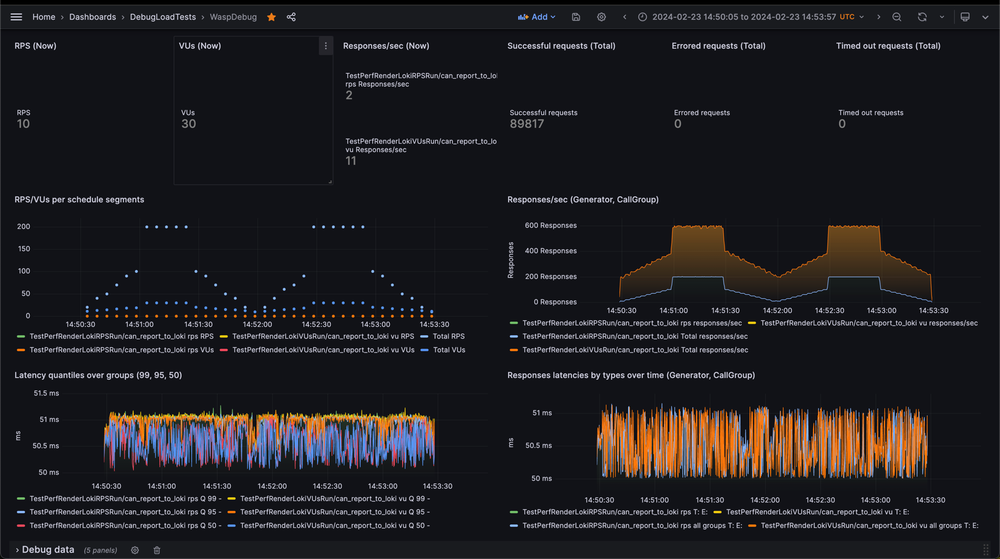

# WASP - Dashboard

> [!WARNING]  
> The API used to check and create alerts is unstable, and the information related to them may be out of date.

WASP comes with a built-in dashboard that allows you to monitor test runs in real-time.  
The dashboard includes several built-in metrics that integrate seamlessly with the `AlertChecker` component.

It is built using the [Grabana](https://pkg.go.dev/github.com/K-Phoen/grabana) library, which you can use to further customize and extend the dashboard by adding your own rows and panels.

> [!NOTE]  
> To create new dashboards, you need to set certain dashboard-specific variables as described in the [Configuration](../configuration.md) section.

---

### Predefined Alerts

WASP comes with predefined alerts for:
* **99th percentile of the response time**
* **Response errors**
* **Response timeouts**

You can use these predefined metrics to add simple alerts to your dashboard for conditions such as:
* Values above or below a threshold
* Averages above or below a threshold
* Percentages of the total above or below a threshold

For a complete list of available conditions, refer to Grabana's [ConditionEvaluator](https://pkg.go.dev/github.com/K-Phoen/grabana@v0.21.18/alert#ConditionEvaluator).

---

### Custom Alerts

Custom alerts can be composed of:
* The simple conditions mentioned above
* Arbitrary Loki queries

Custom alerts use Grabana's [timeseries.Alert](https://pkg.go.dev/github.com/K-Phoen/grabana@v0.21.18/timeseries#Alert) and must be timeseries-based.

> [!NOTE]  
> Adding a built-in alert will also add a new row to the dashboard to display the monitored metric.  
> In contrast, custom alerts do not automatically add rows to the dashboard to prevent clutter.

Each generator has its own metrics, matched by the generator name.

---

### Default Dashboard Panels

The default dashboard includes the following panels:
* Current RPS/VUs (depending on the generator)
* Responses per second
* Total successful requests
* Total failed requests
* Total timeout requests
* RPS/VUs per schedule segment
* Responses per second
* Latency quantiles over groups (p99, p90, p50)
* Response latencies over time
* Logs size per second
* Sampling statistics
* Failed & timed-out responses
* Logs of the statistics-pushing service

Where applicable, these panels group results by generator name (`gen_name` label) and call group (`call_group` label).

> [!NOTE]  
> You can read more about using labels in the [Use labels](../how-to/use_labels.md) section.

---

### Creating a New Dashboard with Alerts

For a practical example of how to create a new dashboard with alerts, see the [Testing Alerts](../testing_alerts.md) section.
