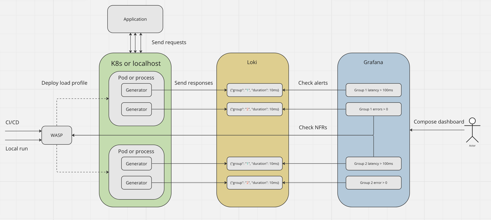

# WASP - Components

In this section, we will briefly describe the main **logical** components that are part of the WASP library:
* [AlertChecker](./alert_checker.md)
* [Dashboard](./dashboard.md)
* [Generator](./generator.md)
* [Loki](./loki.md)
* [Profile](./profile.md)
* [Sampler](./sampler.md)
* [Segment](./schedule)

Brief overview of how WASP works and how different components interact with each other:
