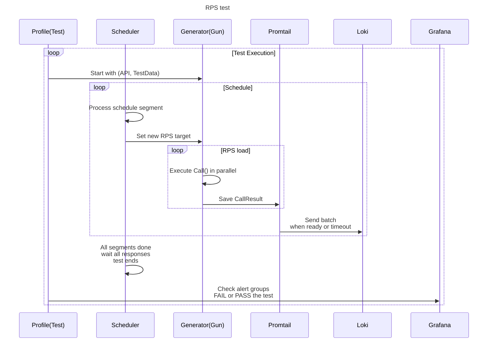
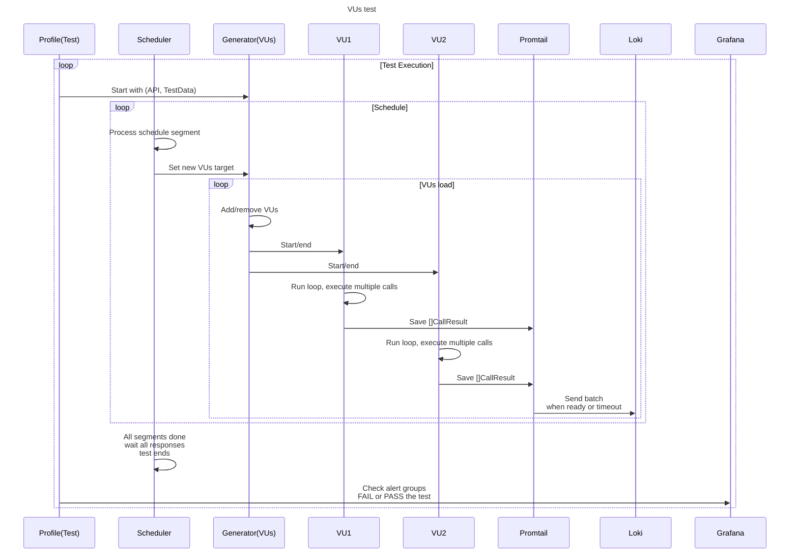

# WASP - How to Choose Between RPS and VUs

When writing a test, you need to decide whether to use **RPS** or **VUs** as your load type.

> [!WARNING]
> RPS load type can only be used with a `Gun`, and VUs can only be used with a `VirtualUser`.

---

## RPS (Requests Per Second)

You should use **RPS** when your goal is to measure **throughput**. This load type implements an **open model**, where:
* The number of requests is fixed.
* The load is adjusted to meet the target RPS.
* The system's response time has no impact on the rate of load generation.

In an RPS-based test, new requests are sent continuously, regardless of how long previous requests take.

> [!NOTE]
> [Read here](./libs/wasp/how-to/rps_per_minute.md) how to define the RPS load in terms of requests per minute or per hour instead of default per second.

### Example RPS Test Diagram

---

## VirtualUser (VUs)

Use **VUs** when working with **stateful protocols** or workflows. With `VirtualUser`, the **requests per second** rate cannot be guaranteed because:
* Each iteration begins only after the previous one finishes.
* The load follows a **closed model**, where the system's response time affects the RPS.

If the system takes longer to respond, iterations take longer, and the RPS decreases.

### Example VUs Test Diagram

In this model, `VU2` starts only after `VU1` has finished its iteration.

---

## Summary

* Use **RPS** for:
    - Stateless protocols.
    - Measuring throughput.
    - Scenarios where the load generation rate must remain constant.

* Use **VUs** for:
    - Stateful protocols.
    - Workflows that involve multiple steps.
    - Scenarios where response time impacts the load generation rate.

> [!NOTE]
> Learn more about open and closed models [here](https://grafana.com/docs/k6/latest/using-k6/scenarios/concepts/open-vs-closed/).