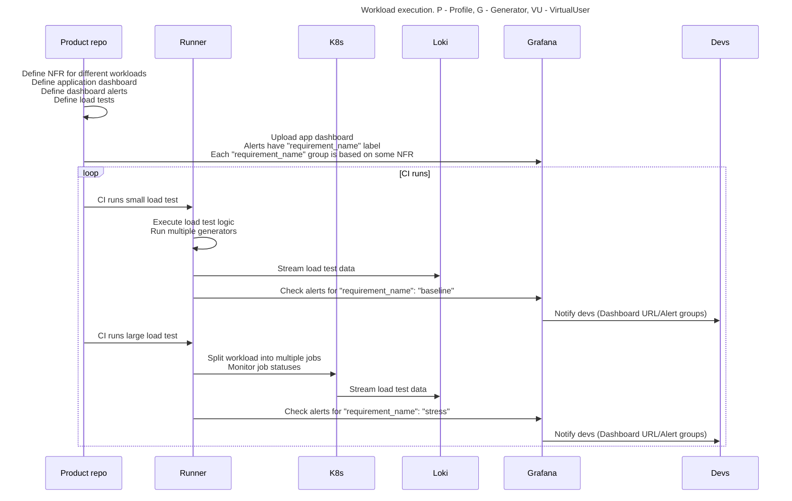

# WASP - How to Incorporate Load Tests in Your Workflow

You might be wondering where load tests belong in the Software Development Life Cycle (SDLC) and how to incorporate them effectively. The diagram below illustrates the recommended approach:

---

### Workflow Explanation

1. **Define Requirements and Dashboards:**
    - Define **NFRs** (Non-Functional Requirements) for different workloads.
    - Create an application dashboard and define alerts grouped by `requirement_name`.  
      Each `requirement_name` group corresponds to a specific NFR.

2. **Integrate into CI/CD:**
    - **Small Load Tests:**  
      Run small load tests as part of your CI pipeline:
        * Execute load test logic with multiple generators.
        * Stream test data to Loki.
        * Check Grafana alerts for the "baseline" group.
        * Notify developers with dashboard URLs and alert group details.
    - **Large Load Tests:**  
      For stress testing:
        * Split the workload into multiple Kubernetes jobs and monitor their statuses.
        * Stream test data to Loki.
        * Check Grafana alerts for the "stress" group.
        * Notify developers with dashboard URLs and alert group details.

3. **Notification and Iteration:**
    - Alerts notify developers about potential issues, directing them to relevant dashboards and alert groups.

---

### Key Points

- **Scalable Testing:** Use small load tests for quick validation in CI and larger tests for stress validation.
- **Real-Time Monitoring:** Leverage Grafana to monitor metrics and alerts during test execution.
- **Team Collaboration:** Automate notifications to keep the team informed of any issues.

This approach ensures that load testing is seamlessly integrated into your SDLC and provides actionable insights for maintaining performance and reliability.