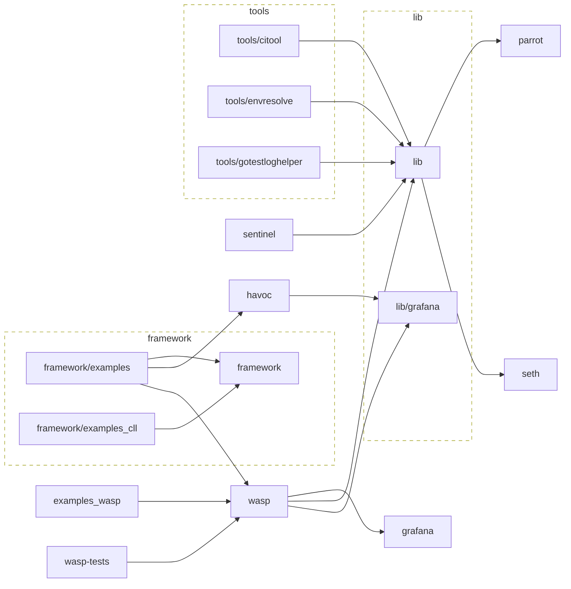

## CTF modules and org dependencies

```mermaid
flowchart LR

	examples_wasp --> wasp
	click examples_wasp href "https://github.com/smartcontractkit/chainlink-testing-framework/examples_wasp"
	framework
	click framework href "https://github.com/smartcontractkit/chainlink-testing-framework/framework"
	framework/examples --> framework
	framework/examples --> havoc
	framework/examples --> wasp
	click framework/examples href "https://github.com/smartcontractkit/chainlink-testing-framework/framework"
	framework/examples_cll --> framework
	click framework/examples_cll href "https://github.com/smartcontractkit/chainlink-testing-framework/framework"
	grafana
	click grafana href "https://github.com/smartcontractkit/chainlink-testing-framework/grafana"
	havoc --> lib/grafana
	click havoc href "https://github.com/smartcontractkit/chainlink-testing-framework/havoc"
	lib --> parrot
	lib --> seth
	click lib href "https://github.com/smartcontractkit/chainlink-testing-framework/lib"
	lib/grafana
	click lib/grafana href "https://github.com/smartcontractkit/chainlink-testing-framework/lib"
	parrot
	click parrot href "https://github.com/smartcontractkit/chainlink-testing-framework/parrot"
	sentinel --> lib
	click sentinel href "https://github.com/smartcontractkit/chainlink-testing-framework/sentinel"
	seth
	click seth href "https://github.com/smartcontractkit/chainlink-testing-framework/seth"
	tools/citool --> lib
	click tools/citool href "https://github.com/smartcontractkit/chainlink-testing-framework/tools"
	tools/envresolve --> lib
	click tools/envresolve href "https://github.com/smartcontractkit/chainlink-testing-framework/tools"
	tools/gotestloghelper --> lib
	click tools/gotestloghelper href "https://github.com/smartcontractkit/chainlink-testing-framework/tools"
	wasp --> grafana
	wasp --> lib
	wasp --> lib/grafana
	click wasp href "https://github.com/smartcontractkit/chainlink-testing-framework/wasp"
	wasp-tests --> wasp
	click wasp-tests href "https://github.com/smartcontractkit/chainlink-testing-framework/wasp-tests"

	subgraph framework-repo[framework]
		 framework
		 framework/examples
		 framework/examples_cll
	end
	click framework-repo href "https://github.com/smartcontractkit/chainlink-testing-framework/framework"

	subgraph lib-repo[lib]
		 lib
		 lib/grafana
	end
	click lib-repo href "https://github.com/smartcontractkit/chainlink-testing-framework/lib"

	subgraph tools-repo[tools]
		 tools/citool
		 tools/envresolve
		 tools/gotestloghelper
	end
	click tools-repo href "https://github.com/smartcontractkit/chainlink-testing-framework/tools"

	classDef outline stroke-dasharray:6,fill:none;
	class framework-repo,lib-repo,tools-repo outline
```
