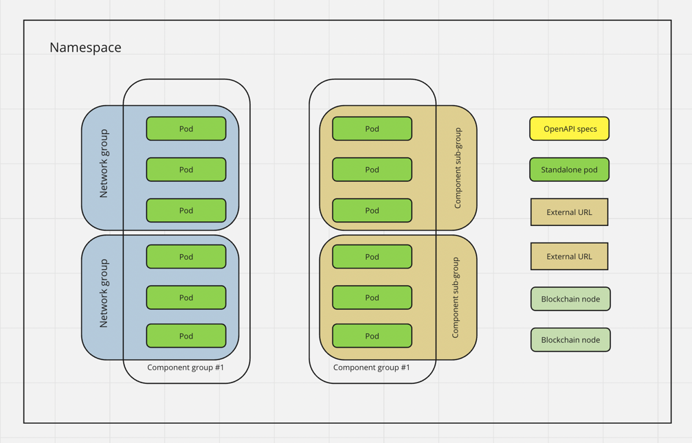

## Havoc

_DISCLAIMER_: This software is not even early Alpha, and still in development, use it on your own risk

Havoc is a tool that introspects your k8s namespace and generates a `ChaosMesh` CRDs suite for you

You can use havoc as a CLI to quickly test hypothesis or run it in "monkey" mode with your load tests and have Grafana annotations

### How it works



Havoc generates groups of experiments based on your pods and labels found in namespace

In order to test your namespace you need to label pods accordingly:

- `havoc-component-group` is like `app.kubernetes.io/component` (see [recommendation](https://kubernetes.io/docs/concepts/overview/working-with-objects/common-labels/)) but should be set explicitly
- `havoc-network-group` in most cases match `havoc-component-group` but sometimes you need to break network even inside component group, ex. distributed databases

Example:

```
      havoc-component-group: node
      havoc-network-group: nodes-1
```

Every pod without a group will be marked as `no-group` and experiments will be assigned accordingly

Single pod experiments:

- PodFailure
- NetworkChaos (Pod latency)
- Stress (Memory)
- Stress (CPU)
- External service failure (Network partition)
- Blockchain specific experiments

Group experiments:

- Group failure
- Group latency
- Group CPU
- Group memory
- Group network partition
- OpenAPI based HTTP experiments

You can generate default chaos suite by [configuring](havoc.toml) havoc then set `dir` param and add your custom experiments, then run monkey to test your services

### Why use it?

#### Without Havoc your workflow is

- Inspect full rendered deployment of your namespace
- Figure out multiple groups of components you can select by various labels or annotations to form experiments
- If some components are not selectable - ask DevOps guys to change the manifests
- Create set of experiments for each chaos experiment type by hand or copy from other product chaos tests
- Calculate permutations of different groups and calculate composite experiments (network partitioning, latency)
- Create experiment for each API in every OpenAPI spec
- Compose huge ChaosMesh Workflow YAML that fails without proper validation errors if group has no match or label is invalid
- Run the load test, then manually run the chaos suite
- Check experiment logs to debug with kubectl
- Figure out which failures are caused by which experiments
- If you have more than one project, use some templating make experiments work for other projects

#### With Havoc

- Have a simple labelling convention for your namespaces, fill 5 vars in `TOML` config
- Run chaos testing with `havoc -c havoc.toml run ${namespace}`

### Install

Please use GitHub releases of this repo
Download latest [release](https://github.com/smartcontractkit/havoc/releases)

You need `kubectl` to available on your machine

You also need [ChaosMesh](https://chaos-mesh.org/) installed in your `k8s` cluster

### Grafana integration

Set env variables

```
HAVOC_LOG_LEVEL={warn,info,debug,trace}
GRAFANA_URL="..."
GRAFANA_TOKEN="..."
```

Set dashboard names in `havoc.toml`

```
[havoc.grafana]
# UIDs of dashboard which should be annotated with chaos experiments metadata
# You can also try to use name as you see it in the top bar of your dashboard but that's not guaranteed to match
dashboard_uids = ["WaspDebug", "e98b5451-12dc-4a8b-9576-2c0b67ddbd0c"]
```

### Manual usage

Generate default experiments for your namespace

```
havoc -c havoc.toml generate [namespace]
```

Check this [section](havoc.toml) for `ignore_pods` and `ignore_group_labels`, default settings should be reasonable, however, you can tweak them

This will create `havoc-experiments` dir, then you can choose from recommended experiments

```
havoc -c havoc.toml apply
```

You can also apply your experiment directly, using absolute or relative path to experiment file

```
havoc -c havoc.toml apply ${experiment_file_path}
```

### Monkey mode

You can run havoc as an automated sequential or randomized suite

```
havoc -c havoc.toml run [namespace]
```

See `[havoc.monkey]` config [here](havoc.toml)

### Programmatic usage

See how you can use recommended experiments from code in [examples](examples)

### Custom experiments

Havoc is just a generator and a module that reads your `dir = $mydir` from config

If you wish to add custom experiments written by hand create your custom directory and add experiments

Experiments will be executed in lexicographic order, however, for custom experiments there are 2 simple rules:

- directory names must be in

```
    "external",
    "failure",
    "latency",
    "cpu",
    "memory",
    "group-failure",
    "group-latency",
    "group-cpu",
    "group-memory",
    "group-partition",
    "blockchain_rewind_head",
    "http"
```

- `metadata.name` should be equal to your experiment filename

When you are using `run` monkey command, if directory is not empty havoc won't automatically generate experiments, so you can extend generated experiments with your custom modifications

### Developing

We are using [nix](https://nixos.org/)

Enter the shell

```
nix develop
```
