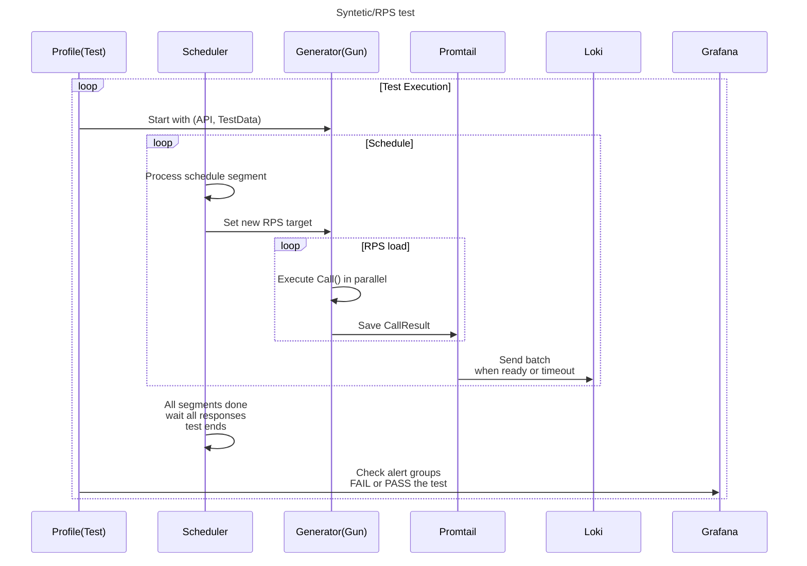
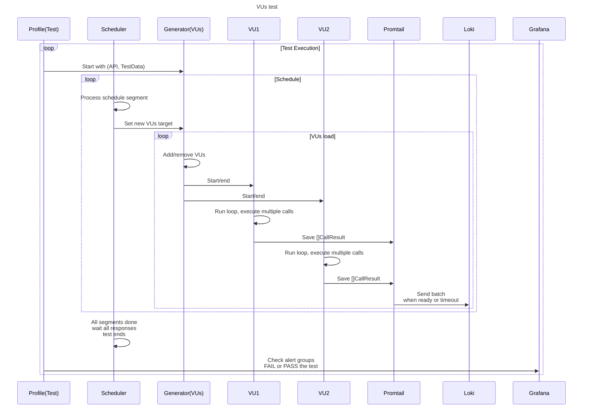
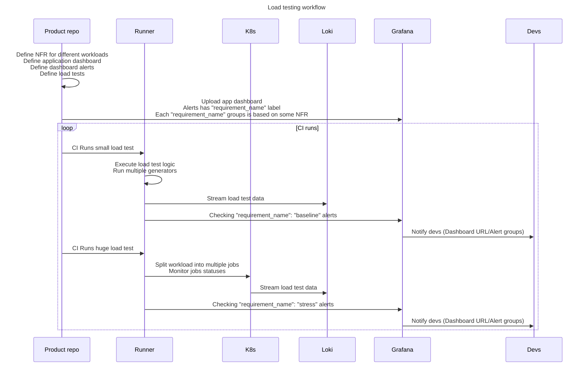
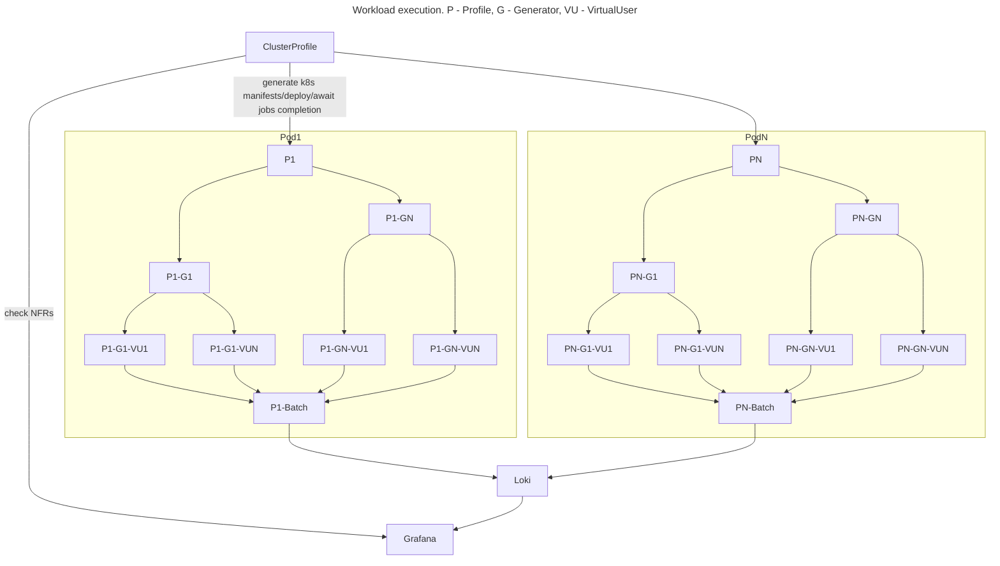

# How it works

## Overview
General idea is to be able to compose load tests programmatically by combining different `Generators`

- `Generator` is an entity that can execute some workload using some `Gun` or `VU` definition, each `Generator` may have only one `Gun` or `VU` implementation used

- `Gun` can be an implementation of single or multiple sequential requests workload for stateless protocols

- `VU` is a stateful implementation that's more suitable for stateful protocols or when your client have some logic/simulating real users

- Each `Generator` have a `Schedule` that control workload params throughout the test (increase/decrease RPS or VUs)

- `Generators` can be combined to run multiple workload units in parallel or sequentially

- `Profiles` are wrappers that allow you to run multiple generators with different `Schedules` and wait for all of them to finish

- `ClusterProfiles` are high-level wrappers that create multiple profile parts and scale your test in `k8s`

- `VU` implementations can also include sequential and parallel requests to simulate users behaviour

- `AlertChecker` can be used in tests to check if any specific alerts with label and dashboardUUID was triggered and update test status

Example `Syntetic/RPS` test diagram:



Example `VUs` test diagram:



Load workflow testing diagram:


Example cluster component diagram:


## Defining NFRs and checking alerts
You can define different non-functional requirements groups
In this example we have 2 groups:
- `baseline` - checking both 99th latencies per `Generator` and errors
- `stress` - checking only errors

`WaspAlerts` can be defined on default `Generators` metrics, for each alert additional row is generated

`CustomAlerts` can be defined as [timeseries.Alert](https://pkg.go.dev/github.com/K-Phoen/grabana@v0.21.18/timeseries#Alert) but timeseries won't be included, though `AlertChecker` will check them

Run 2 tests, change mock latency/status codes to see how it works

Alert definitions usually defined with your `dashboard` and then constantly updated on each Git commit by your CI

After each run `AlertChecker` will fail the test if any alert from selected group was raised
- [definitions](https://github.com/smartcontractkit/wasp/blob/master/examples/alerts/main_test.go#L37)
- [wasp alerts](https://github.com/smartcontractkit/wasp/blob/master/examples/alerts/main_test.go#L73)
- [custom alerts](https://github.com/smartcontractkit/wasp/blob/master/examples/alerts/main_test.go#L82)
- [baseline NFR group test](https://github.com/smartcontractkit/wasp/blob/master/examples/alerts/main_test.go#L115)
- [stress NFR group test](https://github.com/smartcontractkit/wasp/blob/master/examples/alerts/main_test.go#L143)
```
cd examples/alerts
go test -v -count 1 -run TestBaselineRequirements
go test -v -count 1 -run TestStressRequirements
```
Open [alert groups](http://localhost:3000/alerting/groups)

Check [dashboard](http://localhost:3000/d/wasp/wasp-load-generator?orgId=1&refresh=5s&var-go_test_name=All&var-gen_name=All&var-branch=generator_healthcheck&var-commit=generator_healthcheck&from=now-5m&to=now), you can see per alert timeseries in the bottom

## Cluster test with k8s
`Warning`: we don't have Loki + Grafana k8s setup yet, if you have them in your `k8s` set up you can run this test

Cluster mode [overview](examples/CLUSTER.md)

You may also need to set your `LOKI_TOKEN` env var, depends on your authorization

Your `k8s context` should be set up to work with `kubectl`

Set up your namespace with role/rolebinding to be able to run tests:
```
cd charts/wasp
kubectl create ns wasp
kubectl -n wasp apply -f setup.yaml
```
You can build your tests like in example `Dockerfile` in the root dir
```
docker build -f Dockerfile.test --build-arg BUILD_ROOT=/go/src/examples/cluster -t wasp_test .
docker tag wasp_test:latest ${registry}/wasp_test:latest
docker push ${registry}/wasp_test:latest
```

Then run an example test:
```
cd examples/cluster
go test -v -count 1 -run TestClusterScenario .
```

- [cluster test](https://github.com/smartcontractkit/wasp/blob/master/examples/cluster/cluster_test.go#L11)
- [test](https://github.com/smartcontractkit/wasp/blob/master/examples/cluster/node_test.go#L14)
- [vu](https://github.com/smartcontractkit/wasp/blob/master/examples/cluster/vu.go#L70)

Open [dashboard](http://localhost:3000/d/wasp/wasp-load-generator?orgId=1&refresh=5s)

## How to choose RPS vs VU workload
Pick `Gun` if:
- You need to figure out if system can respond to some limited workload
- You have a stateless protocol

Pick `VU` if:
- You need to simulate some client behaviour with user wait time
- You need to execute more than 1 request in a `Call`
- Your protocol is stateful, and you need to test connections or keep some state

Differences between `Gun` and `VU` entities:
- `Gun` should perform 1 call, elapsed time is measured automatically, RPS is limited
- `VU` can perform multiple calls, elapsed time is **not measured** automatically, implementation of `VU` should care about time measurement and rate limiting
